Project 10

Create Ubuntu Ec2 Instance with Port 80,22 and 443 Open

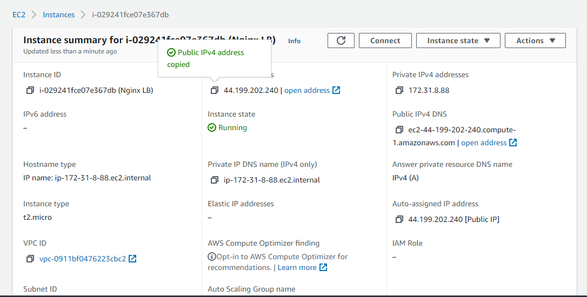

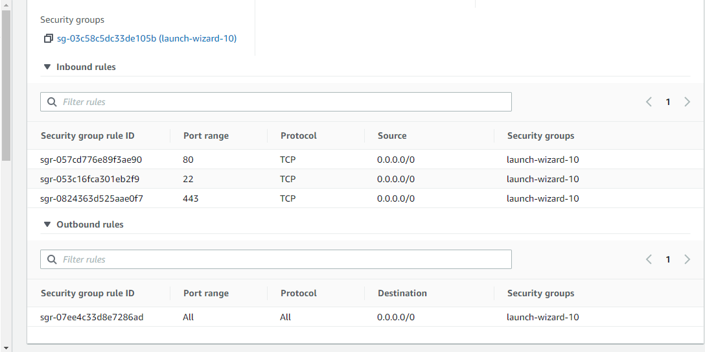

Update server

sudo apt update

and

install Nginix

sudo apt install nginx

Go to route53 on aws

Created a hosted zone with my domain name naturedept.com

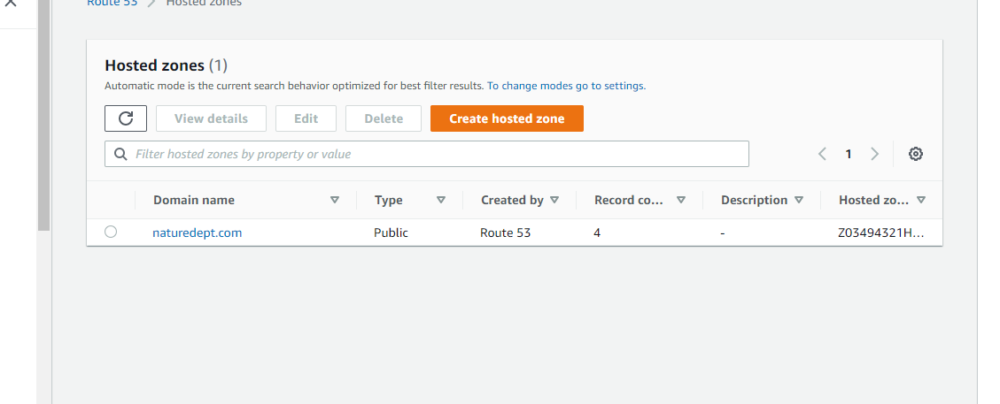

copy name servers from route 53 to domain name dns on namecheap

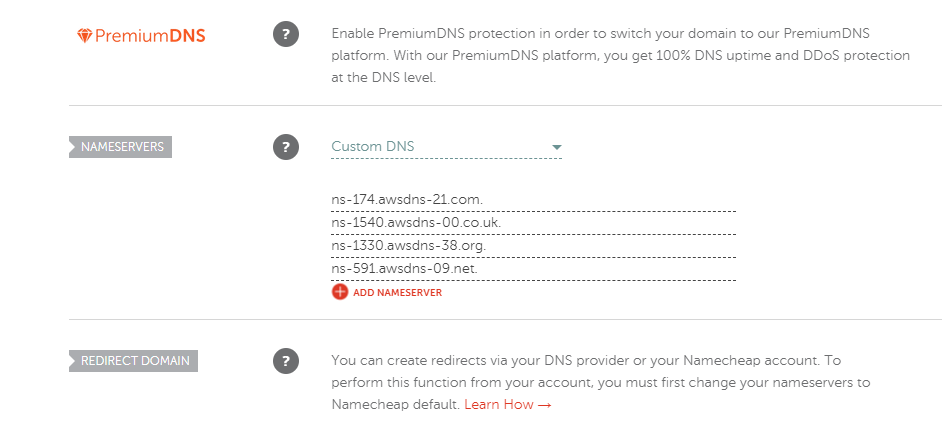

Create a A record on route53 for this hosted zone, using the public ip of Ngnix instance ip on amazon aws

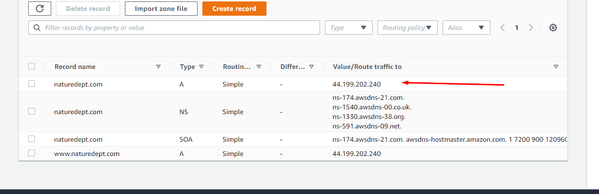

Note for a record leave the first box blank but on wwww record below enter 'www" in first box

Cretae a WWW record using same public ip

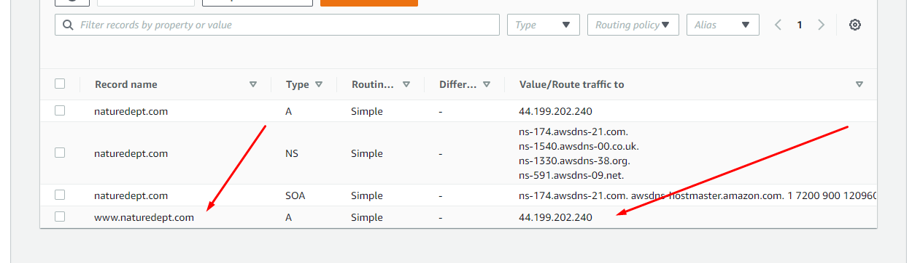

Back to terminal

Run

sudo systemctl enable nginx

sudo systemctl start nginx

Check status of nginx

sudo systemctl status nginx

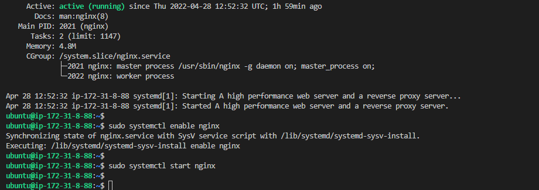

Configure Nginx LB using Web Servers’ names defined in /etc/hosts

sudo vi /etc/nginx/nginx.conf

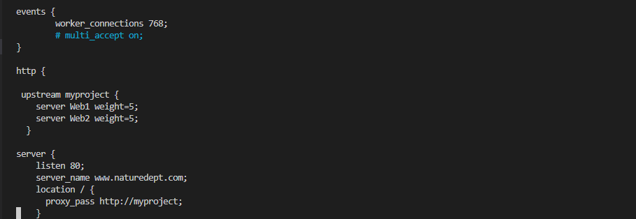

Update /etc/hosts file for local DNS with Web Servers’ names (e.g. Web1 and Web2) and their local IP addresses

sudo nano /etc/hosts

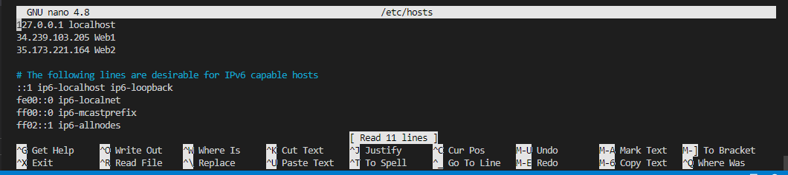

Restart Nginx and make sure the service is up and running

sudo systemctl restart nginx
sudo systemctl status nginx

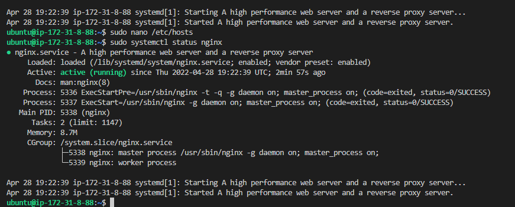

Install certbot and request for an SSL/TLS certificate
Make sure snapd service is active and running

sudo systemctl status snapd

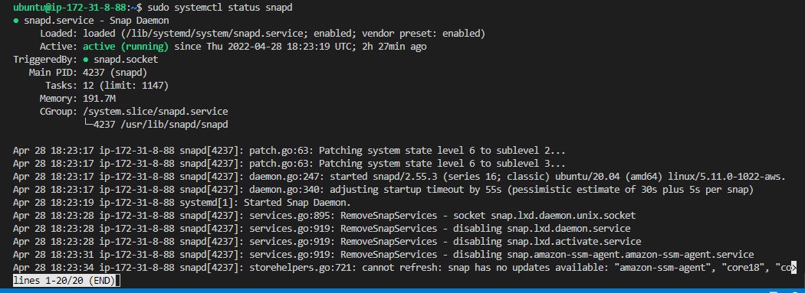

Install certbot

sudo snap install --classic certbot

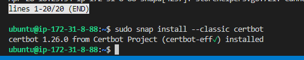

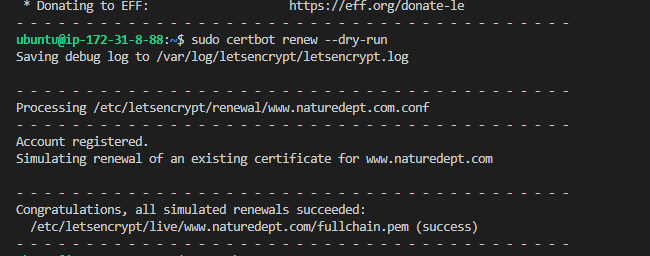

Done

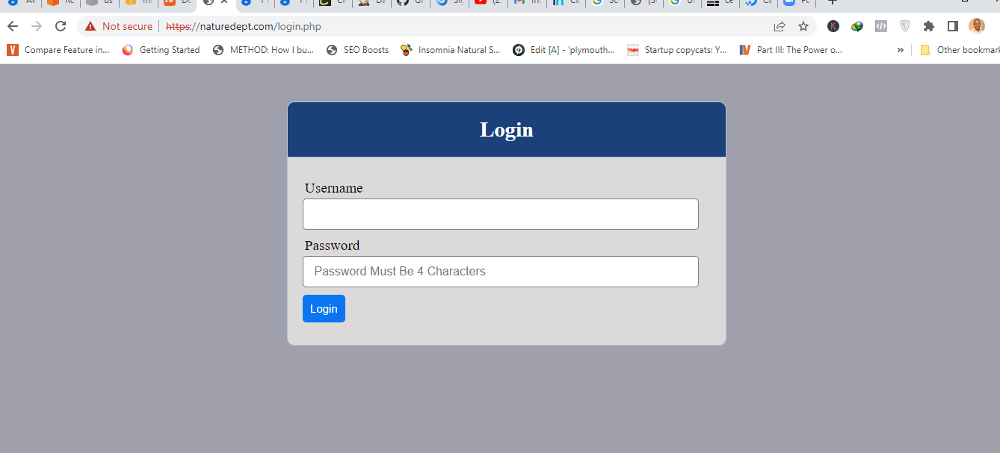

Best pracice is to have a scheduled job that to run renew command periodically. Let us configure a cronjob to run the command twice a day.

To do so, lets edit the crontab file with the following command:

crontab -e
Add following line:

* */12 * * *   root /usr/bin/certbot renew > /dev/null 2>&1

