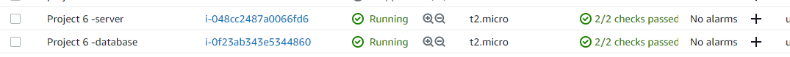

Project 6

Create 2 Ec2 install instances Redhat. 1 Server. 1 Dbase

Create Volumes and attach to server instace

Use gdisk utility to create a single partition on each of the 3 disks and Use pvcreate utility to mark each of 3 disks as physical volumes (PVs) to be used by LVM.

Also Use lvcreate utility to create 2 logical volumes. apps-lv (Use half of the PV size), and logs-lv Use the remaining space of the PV size. NOTE: apps-lv will be used to store data for the Website while, logs-lv will be used to store data for logs.

Wordpress launched and loaded

To be updated