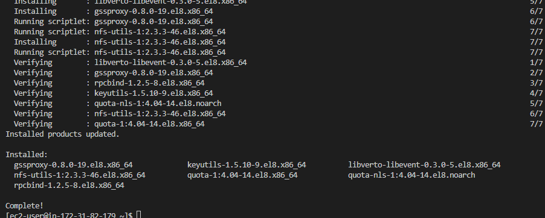

Project 7

Instances created on AWS. 

3 Volumes created for NFS server and attached to NFS server

Logged in to NFS machine on terminal

List Blocks

Gdisk to create single partition on each disks

 

 Install LVM package

 sudo yum install lvm2 -y

  

Check for available partitions

  sudo lvmdiskscan

  

  Create physical volume

  sudo pvcreate /dev/xvdf1

  sudo pvcreate /dev/xvdg1

  sudo pvcreate /dev/xvdh1

  

Check if volumes are present

  sudo pvs

Combine all 3 partitions into 1

sudo vgcreate webdata-vg /dev/xvdh1 /dev/xvdg1 /dev/xvdf1

check for the status of combination

sudo vgs

Create 3 Logical Volumes. lv-opt lv-apps, and lv-logs

sudo lvcreate -n lv-apps -L 9G webdata-vg

Verify setup

sudo vgdisplay -v #view complete setup - VG, PV, and LV

Formart disk as xfs

sudo mkfs -t xfs /dev/webdata-vg/lv-apps

Create mount points

sudo yum -y update

Switched to DATABASE SERVER

sudo apt install mysql-server -y

Threw errror

sudo apt update

Install mysql server

sudo mysql

create database tooling;

Create user

create user 'webaccess'@'172.31.80.0/20' identified by 'password';

Grant webaccess full rights on tooling database

grant all privileges on tooling.* to 'webaccess'@'172.31.80.0/20';

Back to NFS server

sudo yum install nfs-utils -y

sudo systemctl start nfs-server.service

sudo systemctl enable nfs-server.service

sudo systemctl status nfs-server.service

sudo chown -R nobody: /mnt/apps
sudo chown -R nobody: /mnt/logs
sudo chown -R nobody: /mnt/opt

sudo chmod -R 777 /mnt/apps
sudo chmod -R 777 /mnt/logs
sudo chmod -R 777 /mnt/opt

sudo systemctl restart nfs-server.service

Configure access to NFS for clients within the same subnet 

sudo vi /etc/exports

/mnt/apps 172.31.80.0/20(rw,sync,no_all_squash,no_root_squash)
/mnt/logs 172.31.80.0/20(rw,sync,no_all_squash,no_root_squash)
/mnt/opt 172.31.80.0/20(rw,sync,no_all_squash,no_root_squash)

Esc + :wq!

sudo exportfs -arv

SWITCH TO SERVER 1

Mount /var/www/ and target the NFS server’s export for apps

sudo mount -t nfs -o rw,nosuid 172.31.82.179:/mnt/apps /var/www

Install Apache

sudo yum install httpd -y

Install git

sudo yum install git

Fork Repository

git clone https://github.com/darey-io/tooling.git

sudo systemctl start httpd

Load site

Update the website’s configuration to connect to the database

sudo vi /var/www/html/functions.php

sudo yum install mysql

SWITCH TO MYSQL SERVER

Edit mysql.cnf to change bind address and mysql bind address from
127.0.0.1 to 0.0.0.0

sudo vi /etc/mysql/mysql.conf.d/mysqld.cnf

Restart mysql

sudo systemctl restart mysql
sudo systemctl status mysql

SWITCH BACK TO SERVER 1

go to tooling folder

and in mysql run

mysql -h 172.31.89.191 -u webaccess -p tooling < tooling-db.sql

Done!

