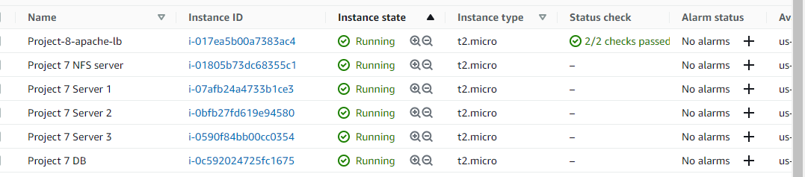
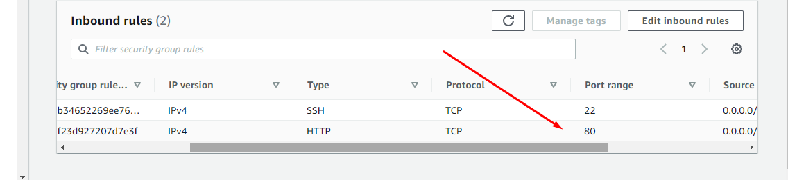
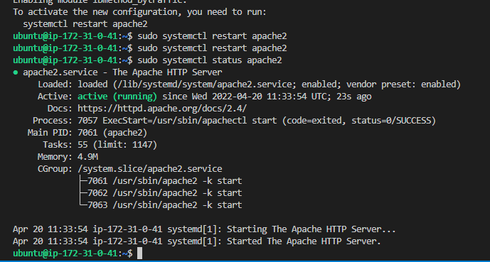
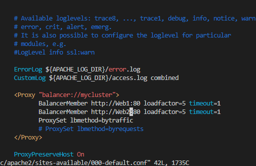
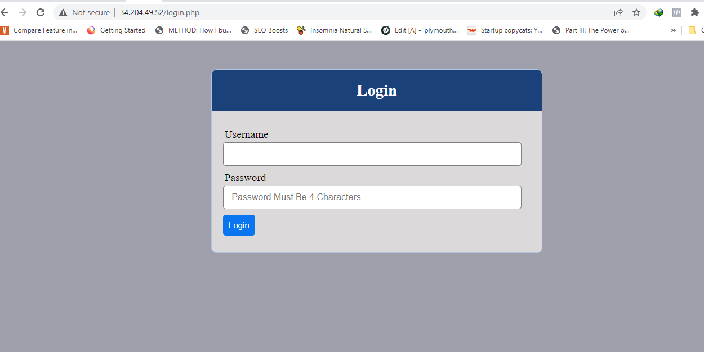
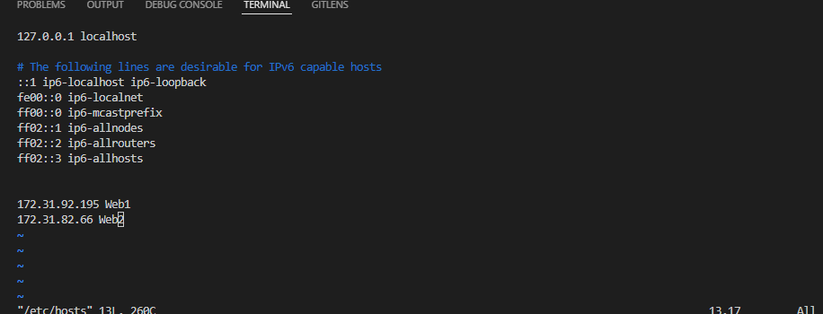
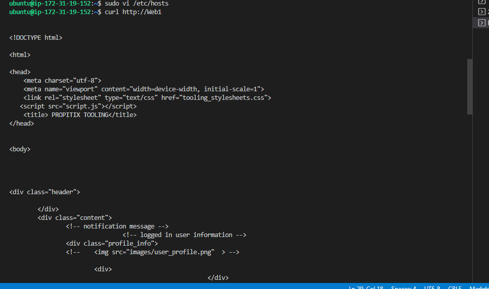

Install Ec2 instance

Open Port 80

Install apache load balancer

sudo apt install apache2 -y

Configure Load Balancing

sudo vi /etc/apache2/sites-available/000-default.conf

Verify that our configuration works – try to access your LB’s public IP address or Public DNS name from your browser

Configure Local DNS Names Resolution

sudo vi /etc/hosts

 curl http://Web1 or curl http://Web2 

 