Project 9

Create Ubuntu Ec2 Instance

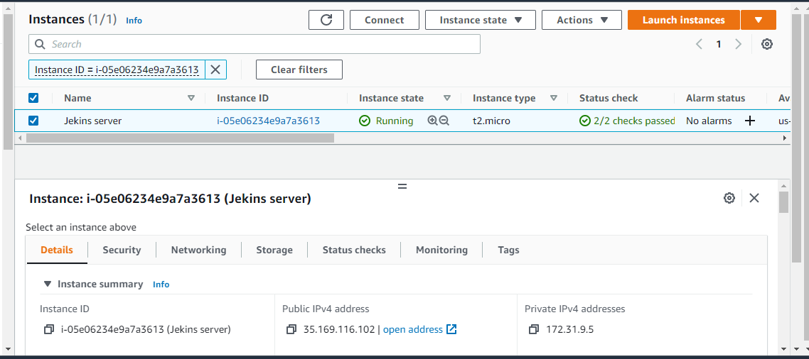

sudo apt update

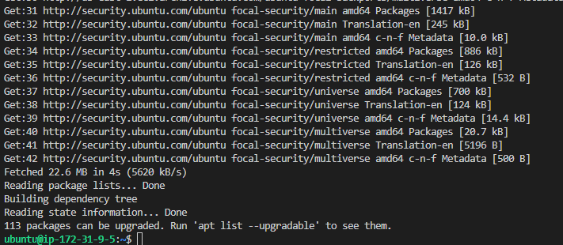

Install JDK

sudo apt install default-jdk-headless

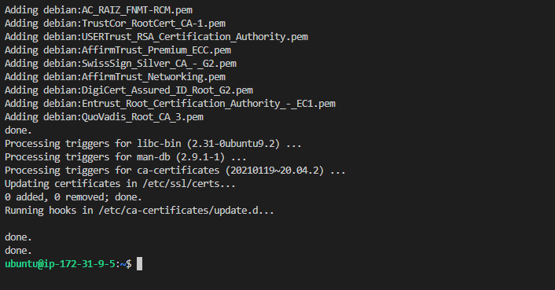

Install jenkins

wget -q -O - https://pkg.jenkins.io/debian-stable/jenkins.io.key | sudo apt-key add -
sudo sh -c 'echo deb https://pkg.jenkins.io/debian-stable binary/ > \
    /etc/apt/sources.list.d/jenkins.list'
sudo apt update
sudo apt-get install jenkins

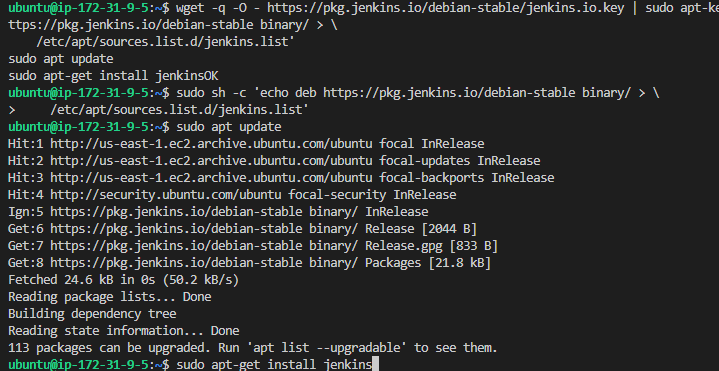

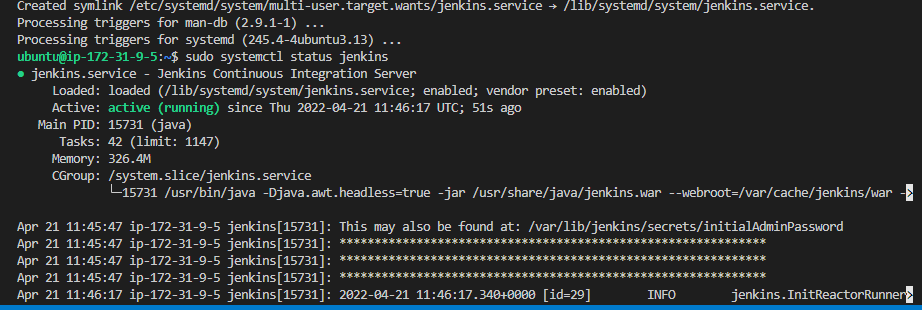

Load site from port 8080 on browser

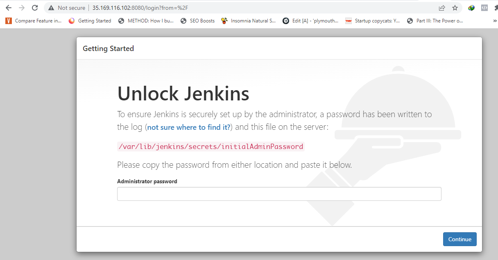

Retrieve password

sudo cat /var/lib/jenkins/secrets/initialAdminPassword

Login

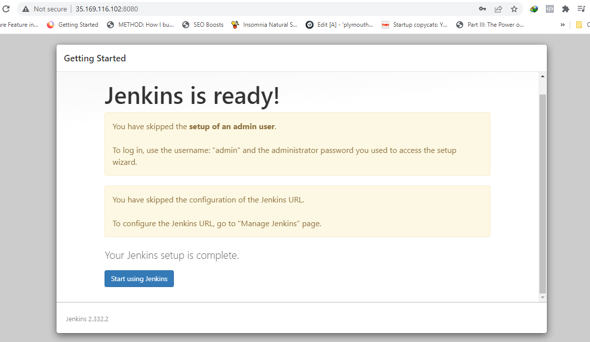

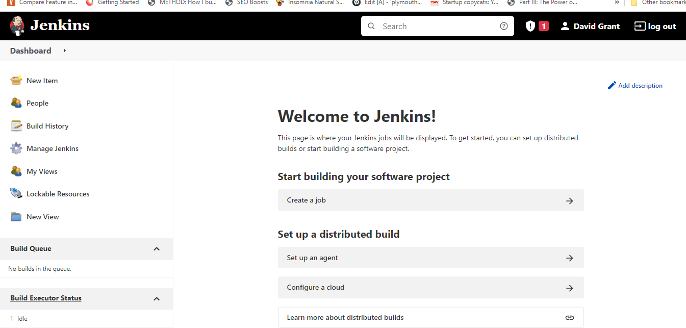

Go to github and created a REPO called tooling

Configure webhook in its settings

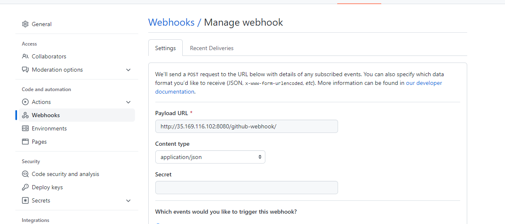

Showed error.

Edited readme file and saved.

Make sure to use public ip of instance not provate

Make sure url is correct

http://35.169.116.102:8080/github-webhook/

Choose json

Edited the read me again and showed sucess mark

Build again and success

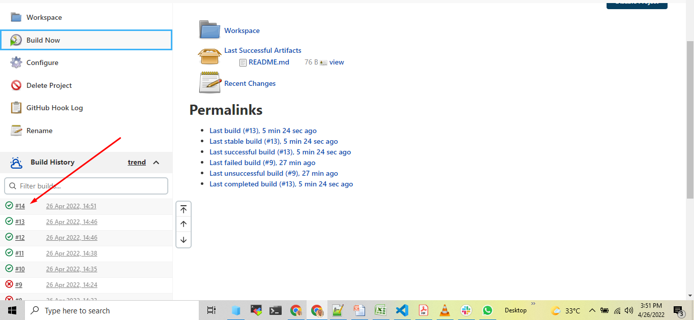

Install Plugin "Publish Over SSH".

Manage jenkins

manage plugins

Install plugins

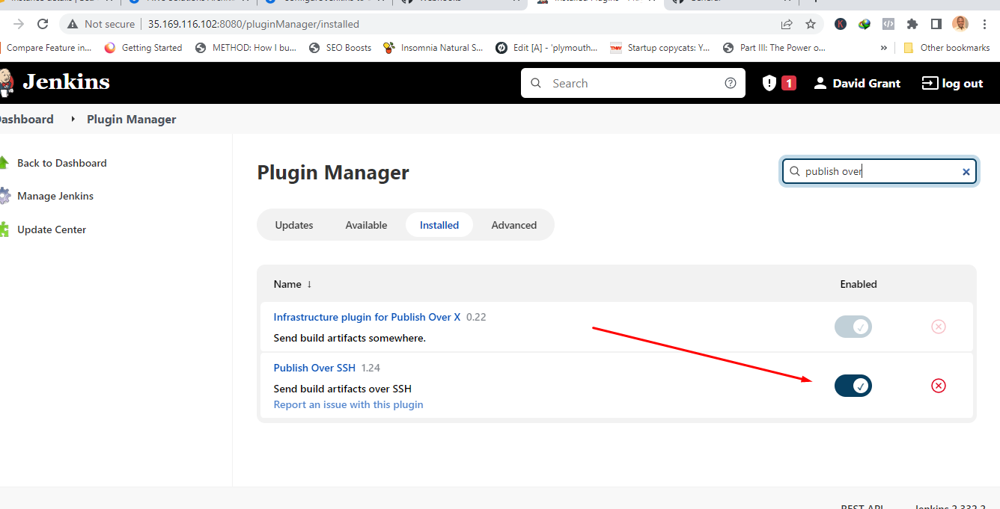

On NFS server mount apps directory

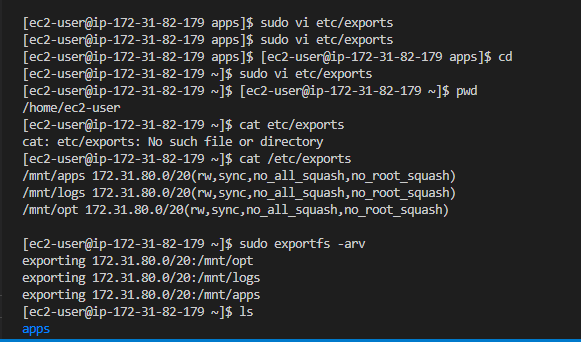

over SSH plugin configuration section

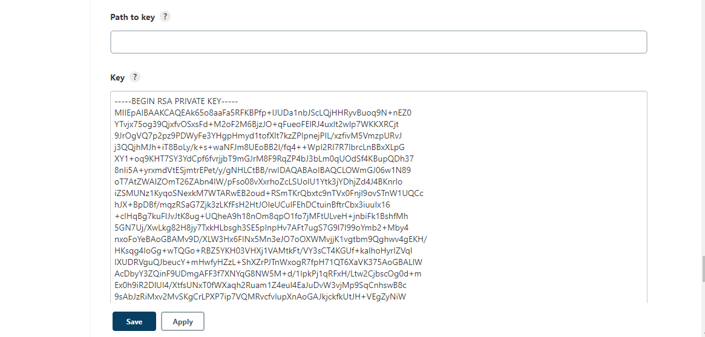

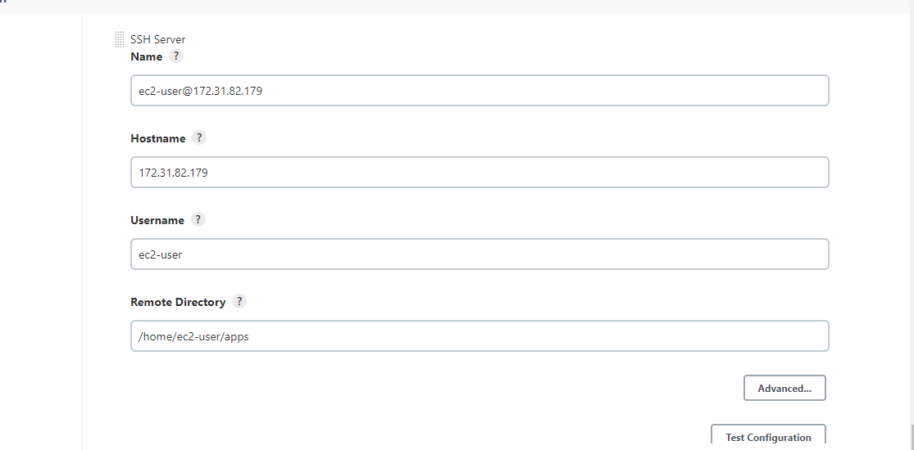

To make sure that the files in /mnt/apps have been udated – connect via SSH/Putty to your NFS server and check README.MD file

cat /mnt/apps/README.md

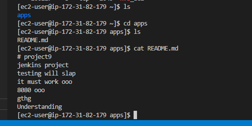

DONE!!!