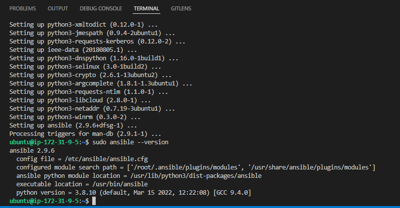
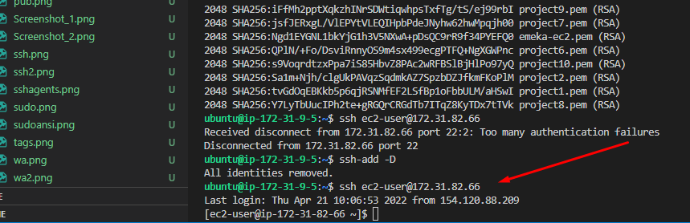

Project 11

Updaate jenkins server tag

Create a new Repo on Github

sudo apt update

sudo apt install ansible

Create a new Freestyle project ansible in Jenkins and point it to your ‘ansible-config-mgt’ repository.

Configure Webhook in GitHub and set webhook to trigger ansible build.

Configure a Post-build job to save all (**) files, like i did it in Project 9.

Test my setup by making some change in README.MD file in master branch and make sure that builds starts automatically and Jenkins saves the files (build artifacts) in following folder
ls /var/lib/jenkins/jobs/ansible/builds/<build_number>/archive/

BEGIN ANSIBLE DEVELOPMENT

In my ansible-config-mgt GitHub repository, created a new branch that will be used for development of a new feature.

on Vs code press, ctrl,shift ,P

Git clone

Choose clone from Github and choose the ansible repository we just created.

Make sure Git for windows installed, if not download and install on ur PC

load new terminal, pick gitbash as terminal type, will ask you to navigate to folder where ansible is located that was just cloned.

Create a new branch

Create a directory and name it playbooks – it will be used to store all your playbook files.

mkdir playbooks

Create a directory and name it inventory – it will be used to keep your hosts organised.

Within the inventory folder, create an inventory file (.yml) for each environment (Development, Staging Testing and Production) dev, staging, uat, and prod respectively.

Lets add SSH agents

Install Open SSH with instructions in link below

https://docs.microsoft.com/en-us/windows-server/administration/openssh/openssh_install_firstuse

Open powershell

Test if you can login to NFS and other servers via ansible on terminal without pem key

Go to ansible project on vs code

Update dev.yml

[nfs]
172.31.82.179 ansible_ssh_user='ec2-user'

[webservers]
172.31.92.195 ansible_ssh_user='ec2-user'
172.31.82.66 ansible_ssh_user='ec2-user'

[db]
172.31.89.191 ansible_ssh_user='ec2-user' 

[lb]
172.31.19.152 ansible_ssh_user='ubuntu'

Update common.yml

Commit your code into GitHub:

use git commands to add, commit and push your branch to GitHub.
git status

git add <selected files>

git commit -m "commit message"
Create a Pull request (PR)

Wear a hat of another developer for a second, and act as a reviewer.

If the reviewer is happy with your new feature development, merge the code to the master branch.

Head back on your terminal, checkout from the feature branch into the master, and pull down the latest changes.

Check jenkins

Once your code changes appear in master branch – Jenkins will do its job and save all the files (build artifacts) to /var/lib/jenkins/jobs/ansible/builds/<build_number>/archive/ directory on Jenkins-Ansible server.

ANSIBLE TEST

Connect to ansible /jenkins server

