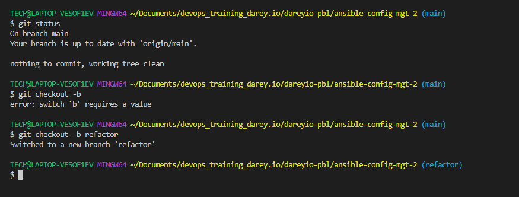
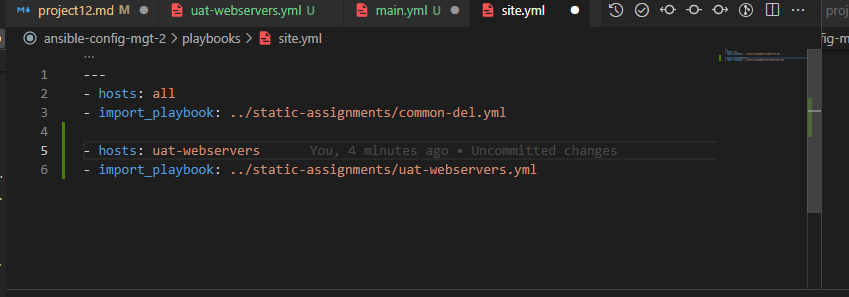

Project 12

Install Ubuntu Instance with Scripts loaded to run on deployment.

#!/usr/bin/bash
curl -fsSL https://pkg.jenkins.io/debian-stable/jenkins.io.key | sudo tee \
 /usr/share/keyrings/jenkins-keyring.asc > /dev/null
echo deb [signed-by=/usr/share/keyrings/jenkins-keyring.asc] \
    https://pkg.jenkins.io/debian-stable binary/ | sudo tee \
    /etc/apt/sources.list.d/jenkins.list > /dev/null
sudo apt-get update -y
  sudo apt-get install fontconfig openjdk-11-jre -y
  sudo apt-get install jenkins

  
  Add the ubuntun server pem key to ssh agent on local pc

Confirm that Jenkins is inatlled

Run sudo cat /var/lib/jenkins/secrets/initialAdminPassword

to get scret key

Pass as pssword.

install suggested plugins

Update Webhook in github.

Open ansible repo and go to settings - update ip.

Go to Jenkins and do a build.

Go to your Jenkins-Ansible server and create a new directory called ansible-config-artifact – we will store there all artifacts after each build.

sudo mkdir /home/ubuntu/ansible-config-artifact

Change Dir Permissions

sudo chmod -R 0777 /home/ubuntu/ansible-config-artifact

or 

sudo chmod -R 0777 /home

Go to Jenkins web console -> Manage Jenkins -> Manage Plugins -> on Available tab search for Copy Artifact and install this plugin without restarting Jenkins

Create a new Freestyle project and name it save_artifacts.

Configured with following things

name should be project12 not ansible in our case.

Edit Readme file in Ansible Repo on github

check if push worked?

Success

Create static-assignements folder in ansible repo
and create site.yml under playboook folder

Move common.yml into static assignments folder

Push to github.

Now connect to remote host of jenkins-ansible server.

I did was not seeing the full folders and files i pushed.

So i went back to my project 12 config in jenkins

I changed the branch to main, since vscode pushed to main branch.

How do i know?

I went to github and saw that the main branch had the files i pushed and master was outdated.

To test i edited the README.md file on main branch and saved and lo and behold check project 12 in jenkins and a build was triggered successfully.

Now connect to remote host. Files were showing now.

I ran

ansible all -m ping

and it said ansible not installed.

So i went back to other vscode window to install ansible.

This happened because i lost my aws account and created EC2 instaces afresh.

Connected to remote server and tried to run ansible all -m ping

Some of the server had the wrong private ip and user stated in the dev.yml file.

I saved and tried to connect to the remote server and got errors connection.

I had to open the ssh config file on my pc to see that the jenkins ansible server ip there is wrong.

I tried againa and same thing. So i checked aws and saw that the server had errors.

So i stopped it and started it. Errors now gone.

Tried to connect agai remotely and connected.

Ran the command ansible all -m ping

It piged al servers minus LB server.

Ignored it and did a cd to the ansible directory amd ran my playbook.

It worked.

Log into LB server.

wireshark has been deleted.

Create a new branch on github.

Pause all intances on ec2 minus jenkins

Create 2 New Redhat ec2 severs and open ports 80 and port 8080

Update my inventory ansible-config-artifact/inventory/uat.yml file with private IP addresses of your 2 UAT Web servers

Under ansible folder, in vscode create the following

Now login to the jenkins server via ssh and edit /etc/ansible/ansible.cfg

Within the static-assignments folder, create a new assignment for uat-webservers uat-webservers.yml. This is where you will reference the role.

---
- hosts: uat-webservers
  roles:
     - webserver

Edit site.yml to the following

---
- hosts: all
- import_playbook: ../static-assignments/common.yml

- hosts: uat-webservers
- import_playbook: ../static-assignments/uat-webservers.yml

Edit main.yml under tasks folder

and paste in the following

---
- name: install apache
  become: true
  ansible.builtin.yum:
    name: "httpd"
    state: present

- name: install git
  become: true
  ansible.builtin.yum:
    name: "git"
    state: present

- name: clone a repo
  become: true
  ansible.builtin.git:
    repo: https://github.com/<your-name>/tooling.git
    dest: /var/www/html
    force: yes

- name: copy html content to one level up
  become: true
  command: cp -r /var/www/html/html/ /var/www/

- name: Start service httpd, if not started
  become: true
  ansible.builtin.service:
    name: httpd
    state: started

- name: recursively remove /var/www/html/html/ directory
  become: true
  ansible.builtin.file:
    path: /var/www/html/html
    state: absent

Now do a push to github main branch.

Go to github and do a pull request.

make sure to select main branch as source.

On bash terminal on vscode do a git checkout main.

and do a git pull  so that the changes from main branch on github matches tha on our pc.

Run ansible playbook

sudo ansible-playbook -i /home/ubuntu/ansible-config-artifact/inventory/uat.yml /home/u
buntu/ansible-config-artifact/playbooks/site.yml

I got an error.

So i looked at the site.yml

Host is difeined as all

So it is calling all servers and i stopped the instances LB,DB,Webserver 1, Webserver 2, and NFS

si i went to Ec2 and started all the instance and got success.

Now both sites are loading

