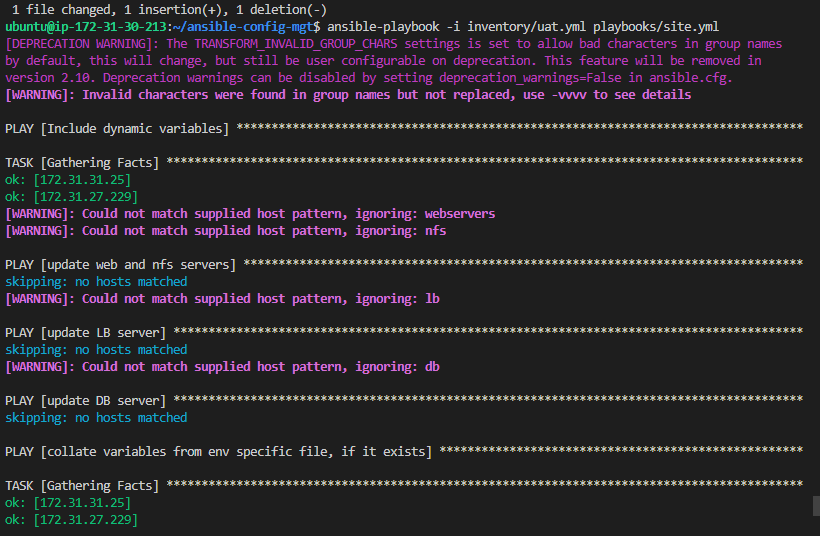

Log in to gitbash terminal with ansible mgt folder

Create a new branch called dynamic-assignments

git checkout -b dynamic-assignments

Create a file called en-vars.yml under it

Now create a folder in ansible call env-sars and create the following files under it.

in the en-vars.yml, paste the following codes.

---
- name: collate variables from env specific file, if it exists
  hosts: all
  tasks:
    - name: looping through list of available files
      include_vars: "{{ item }}"
      with_first_found:
        - files:
            - dev.yml
            - stage.yml
            - prod.yml
            - uat.yml
          paths:
            - "{{ playbook_dir }}/../env-vars"
      tags:
        - always

Now since i stopped and started my instaces in project 12, the jenkins ansible server Public i[ has changed.

So i updated ip in ansible repo on github webhook.

then did a push from vscode to git hub to cause a trigger in jenkins and therefore my jenkins ansible server.

Login into the ssh.

Change directory to ansible-config-artifact

cd roles

run git init

run ansible-galaxy install geerlingguy.mysql

rename the folder rename the folder to mysql with mv geerlingguy.mysql/ mysql

Download the roles folder from remote server to local pc and copy into ansible folder in local pc.

Now its time to edit the main.yml file in roles/mysql/default folder

Inside roles directory create new roles Nginx and Apache

and run commands

ansible-galaxy install geerlingguy.nginx

and

ansible-galaxy install geerlingguy.apache

Rename the servers as in the below images

Download the new nginix and apache folders and copy into ansible project directory on my laptop

Go to ubuntu remote server and navigate to ansible-config-artifact/roles/ngnix/defaults/main.yml file

Tweak the following

Go to on remote server

ansible-config-artifact/roles/ngnix/tasks/main.yml and edit below

Download Roles folder from ubuntu server

Paste ansible folder, replace the roles folder

push to main branch to github.

ansible-config-artifact/roles/apache/defaults/main.yml 

Edit the neccesary Nginx files

We move on

Lets pause

One big mistake i made is i did not know i was supposed to watch the git and ansible courses.

so after this project13, ill go and watch.

Now

My thought was

Edit on vscode , push to github, github via webhook writes to server. Github cant.

So i was editing the files on the server via remote connection on nano or vi, then down the roles file on my pc and over write the files in the roles folder under the ansible folder on my pc, then go to vscode and push to github.

The better way is to edit on vscode, push to github and do

git pull https://github.com/synaptium/ansible-config-mgt.git

This way i download the complete folder on the server and run my playbook from there.

Now i encountered several errors whiles running playbook but i forgot to documents.

Here are some

In this case i was to put a quote around that host ip like so.

Also another issue, david helped with this.

I changed the username for the mysql as below

I had other errors, like running the playbook from the root instead of the folder for ansible

I also had errors of several files missing.

Since i had not known the git pull by then, i was just creating the file on the servers that were missing.

I had another error

You see i was running playbook from ansible-config-mgt directory but the error was saying it did not find a file in the ansible-config-artifact directory.

The issues was in my config file for ansible

The file for ansible ws the artifact one and not mgt

So finally ran my playbbok and had success.

P.S the ansible-config-artifact folder is the old folder..was having issues so i git a git clone and it dowbloaded the ansible-config-mgt folder i now worked with.

