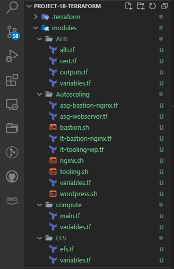
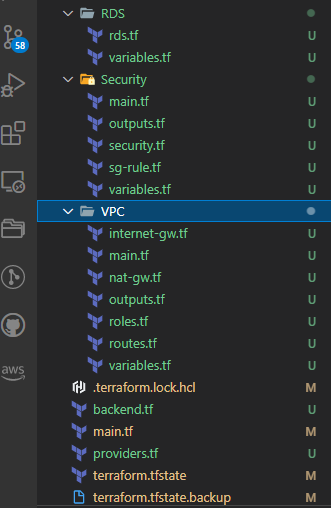
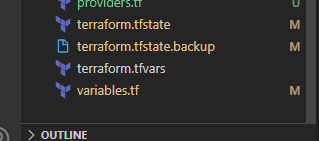
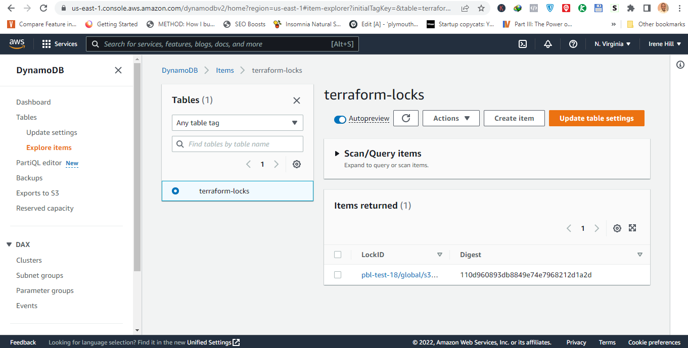
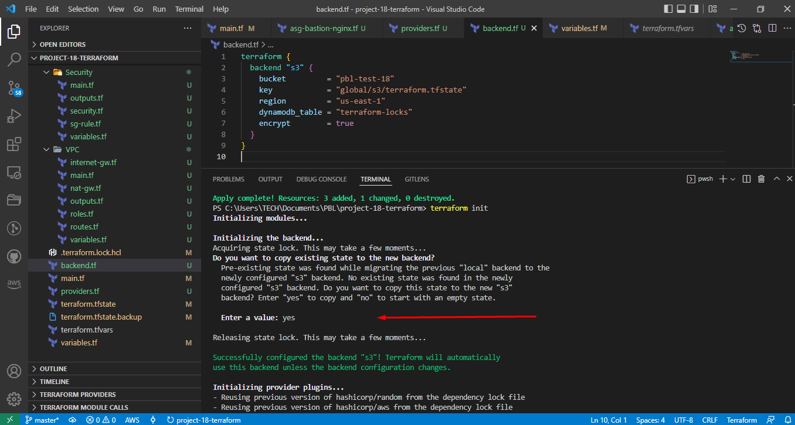
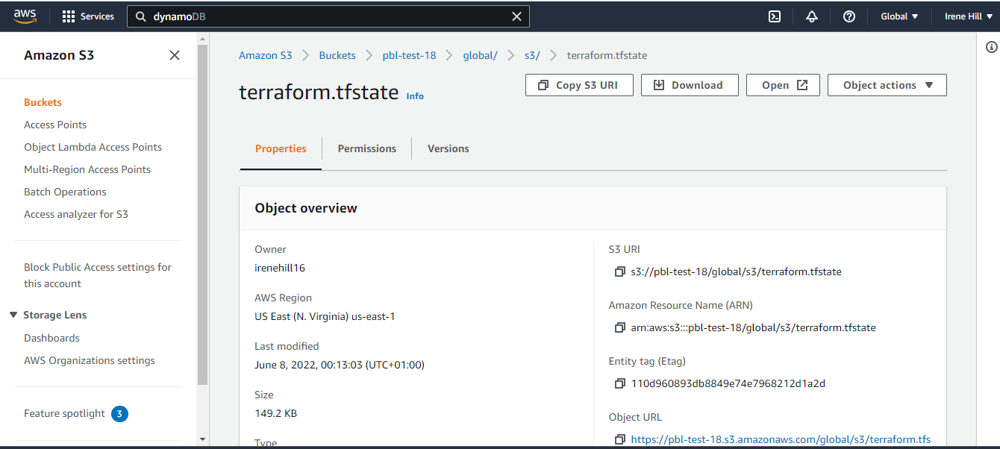
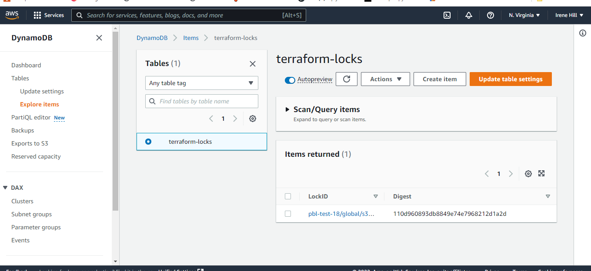
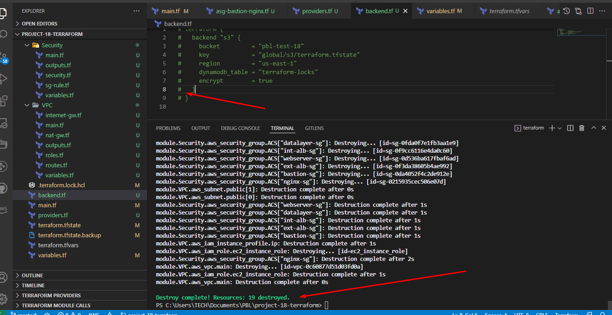

Automate Infrastructure With IaC using Terraform-Part 3


Createed a new folder for project 18.

Copied all project 17 files into it and delete the terraformstate files

open terminal and create new dir called modules and cd into it


## Create the Project Using Modules

Inside modules create the following dirs.

ALB Autoscaling compute EFS RDS Security VPC

Struture the files this way. Try









## Introducing Backend and State Locking


I created a file backend.tf then paste code below to create s3 resource for the backend and dynamodb for the state locking.

```

#############################
##creating bucket for s3 backend
#########################

resource "aws_s3_bucket" "terraform-state" {
  bucket        = "pbl-test-18"
  force_destroy = true
}
resource "aws_s3_bucket_versioning" "version" {
  bucket = aws_s3_bucket.terraform-state.id
  versioning_configuration {
    status = "Enabled"
  }
}
resource "aws_s3_bucket_server_side_encryption_configuration" "first" {
  bucket = aws_s3_bucket.terraform-state.id
  rule {
    apply_server_side_encryption_by_default {
      sse_algorithm = "AES256"
    }
  }
}

resource "aws_dynamodb_table" "terraform_locks" {
  name         = "terraform-locks"
  billing_mode = "PAY_PER_REQUEST"
  hash_key     = "LockID"
  attribute {
    name = "LockID"
    type = "S"
  }
}


```


Running terraform apply to create the resource.



Create a file backend.tf

```

terraform {
  backend "s3" {
    bucket         = "pbl-test-18"
    key            = "global/s3/terraform.tfstate"
    region         = "us-east-1"
    dynamodb_table = "terraform-locks"
    encrypt        = true
  }
}

```


Run terraform init




Run terraform validate
Terraform apply --auto-update





All resources created.


Destroy resources




The files for this project are [located here](https://pages.github.com/).