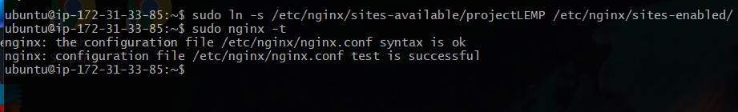

Project 2

Launch Git Bash and run following command:
ssh -i <Your-private-key.pem> ubuntu@<EC2-Public-IP-address>

Step 1 – Installing the Nginx Web Server
In order to display web pages to our site visitors, we are going to employ Nginx, a high-performance web server. We’ll use the apt package manager to install this package.

Since this is our first time using apt for this session, start off by updating your server’s package index.
$ sudo apt update

Following that, you can use apt install to get Nginx installed:
$ sudo apt install nginx

To verify that nginx was successfully installed and is running as a service in Ubuntu, run:
$ sudo systemctl status nginx

As we know, we have TCP port 22 open by default on our EC2 machine to access it via SSH, so we need to add a rule to EC2 configuration to open inbound connection through port 80:

Our server is running and we can access it locally and from the Internet (Source 0.0.0.0/0 means ‘from any IP address’).

First, let us try to check how we can access it locally in our Ubuntu shell, run:

$ curl http://localhost:80
or
$ curl http://127.0.0.1:80

Now it is time for us to test how our Nginx server can respond to requests from the Internet. Open a web browser of your choice and try to access following url:
http://<Public-IP-Address>:80

Another way to retrieve your Public IP address, other than to check it in AWS Web console, is to use following command:

curl -s http://169.254.169.254/latest/meta-data/public-ipv4

If you see following page, then your web server is now correctly installed and accessible through your firewall.

Step 2 — Installing MySQL
Now that you have a web server up and running, you need to install a Database Management System (DBMS) to be able to store and manage data for your site in a relational database. MySQL is a popular relational database management system used within PHP environments, so we will use it in our project.

Again, use apt to acquire and install this software:
$ sudo apt install mysql-server

When the installation is finished, it’s recommended that you run a security script that comes pre-installed with MySQL. This script will remove some insecure default settings and lock down access to your database system. Start the interactive script by running:
$ sudo mysql_secure_installation
This will ask if you want to configure the VALIDATE PASSWORD PLUGIN. Answer Y for yes, or anything else to continue without enabling.

If you answer “yes”, you’ll be asked to select a level of password validation. Keep in mind that if you enter 2 for the strongest level, you will receive errors when attempting to set any password which does not contain numbers, upper and lowercase letters, and special characters, or which is based on common dictionary words.

If you enabled password validation, you’ll be shown the password strength for the root password you just entered and your server will ask if you want to continue with that password. If you are happy with your current password, enter Y for “yes” at the prompt:

For the rest of the questions, press Y and hit the ENTER key at each prompt. This will remove some anonymous users and the test database, disable remote root logins, and load these new rules so that MySQL immediately respects the changes you have made.

When you’re finished, test if you’re able to log in to the MySQL console by typing:
$ sudo mysql
This will connect to the MySQL server as the administrative database user root, which is inferred by the use of sudo when running this command. You should see output like this:

To exit the MySQL console, type:
mysql> exit

Your MySQL server is now installed and secured. Next, we will install PHP, the final component in the LEMP stack.

Step 3 – Installing PHP
You’ll need to install php-fpm, which stands for “PHP fastCGI process manager”, and tell Nginx to pass PHP requests to this software for processing. Additionally, you’ll need php-mysql, a PHP module that allows PHP to communicate with MySQL-based databases. Core PHP packages will automatically be installed as dependencies.

To install these 2 packages at once, run:
$ sudo apt install php-fpm php-mysql

You now have your PHP components installed. Next, you will configure Nginx to use them.

Step 4 — Configuring Nginx to Use PHP Processor
When using the Nginx web server, we can create server blocks (similar to virtual hosts in Apache) to encapsulate configuration details and host more than one domain on a single server. In this guide, we will use projectLEMP as an example domain name.

Create the root web directory for your_domain as follows:
$ sudo mkdir /var/www/projectLEMP
Next, assign ownership of the directory with the $USER environment variable, which will reference your current system user:
$ sudo chown -R $USER:$USER /var/www/projectLEMP
Then, open a new configuration file in Nginx’s sites-available directory using your preferred command-line editor. Here, we’ll use nano:
$ sudo nano /etc/nginx/sites-available/projectLEMP

This will create a new blank file. Paste in the following bare-bones configuration:
#/etc/nginx/sites-available/projectLEMP

server {
    listen 80;
    server_name projectLEMP www.projectLEMP;
    root /var/www/projectLEMP;

    index index.html index.htm index.php;

    location / {
        try_files $uri $uri/ =404;
    }

    location ~ \.php$ {
        include snippets/fastcgi-php.conf;
        fastcgi_pass unix:/var/run/php/php7.4-fpm.sock;
     }

    location ~ /\.ht {
        deny all;
    }

}

When you’re done editing, save and close the file. If you’re using nano, you can do so by typing CTRL+X and then y and ENTER to confirm.

Activate your configuration by linking to the config file from Nginx’s sites-enabled directory:

$ sudo ln -s /etc/nginx/sites-available/projectLEMP /etc/nginx/sites-enabled/
This will tell Nginx to use the configuration next time it is reloaded. You can test your configuration for syntax errors by typing:
$ sudo nginx -t
You shall see following message:
nginx: the configuration file /etc/nginx/nginx.conf syntax is ok
nginx: configuration file /etc/nginx/nginx.conf test is successful

We also need to disable default Nginx host that is currently configured to listen on port 80, for this run:
$ sudo unlink /etc/nginx/sites-enabled/default
When you are ready, reload Nginx to apply the changes:
$ sudo systemctl reload nginx
Your new website is now active, but the web root /var/www/projectLEMP is still empty. Create an index.html file in that location so that we can test that your new server block works as expected:
sudo echo 'Hello LEMP from hostname' $(curl -s http://169.254.169.254/latest/meta-data/public-hostname) 'with public IP' $(curl -s http://169.254.169.254/latest/meta-data/public-ipv4) > /var/www/projectLEMP/index.html

Now go to your browser and try to open your website URL using IP address:
http://<Public-IP-Address>:80

You can also access your website in your browser by public DNS name, not only by IP - try it out, the result must be the same (port is optional)
http://<Public-DNS-Name>:80

If you see the text from ‘echo’ command you wrote to index.html file, then it means your Nginx site is working as expected. In the output you will see your server’s public hostname (DNS name) and public IP address.

Your LEMP stack is now fully configured. In the next step, we’ll create a PHP script to test that Nginx is in fact able to handle .php files within your newly configured website.

Step 5 – Testing PHP with Nginx
Your LEMP stack should now be completely set up.

You can test it to validate that Nginx can correctly hand .php files off to your PHP processor by creating a test PHP file in your document root. Open a new file called info.php within your document root in your text editor:
$ nano /var/www/projectLEMP/info.php
Type or paste the following lines into the new file. This is valid PHP code that will return information about your server:

You can now access this page in your web browser by visiting the domain name or public IP address you’ve set up in your Nginx configuration file, followed by /info.php:
http://`server_domain_or_IP`/info.php
You will see a web page containing detailed information about your server:

After checking the relevant information about your PHP server through that page, it’s best to remove the file you created as it contains sensitive information about your PHP environment and your Ubuntu server. You can use rm to remove that file:

$ sudo rm /var/www/your_domain/info.php

tep 6 — Retrieving data from MySQL database with PHP
In this step you will create a test database (DB) with simple “To do list” and configure access to it, so the Nginx website would be able to query data from the DB and display it.

We will create a database named example_database and a user named example_user, but you can replace these names with different values.

First, connect to the MySQL console using the root account:
$ sudo mysql
To create a new database, run the following command from your MySQL console:
mysql> CREATE DATABASE `example_database`;

The following command creates a new user named example_user, using mysql_native_password as default authentication method. We’re defining this user’s password as password, but you should replace this value with a secure password of your own choosing.

mysql>  CREATE USER 'example_user'@'%' IDENTIFIED WITH mysql_native_password BY 'password';

Now we need to give this user permission over the example_database database:
mysql> GRANT ALL ON example_database.* TO 'example_user'@'%';

This will give the example_user user full privileges over the example_database database, while preventing this user from creating or modifying other databases on your server.

Now exit the MySQL shell with:
mysql> exit

You can test if the new user has the proper permissions by logging in to the MySQL console again, this time using the custom user credentials:
$ mysql -u example_user -p

Notice the -p flag in this command, which will prompt you for the password used when creating the example_user user.

After logging in to the MySQL console, confirm that you have access to the example_database database:
mysql> SHOW DATABASES;
This will give you the following output:

+--------------------+
| Database           |
+--------------------+
| example_database   |
| information_schema |
+--------------------+
2 rows in set (0.000 sec)

Next, we’ll create a test table named todo_list. From the MySQL console, run the following statement:
CREATE TABLE example_database.todo_list (
mysql>     item_id INT AUTO_INCREMENT,
mysql>     content VARCHAR(255),
mysql>     PRIMARY KEY(item_id)
mysql> );
Insert a few rows of content in the test table. You might want to repeat the next command a few times, using different VALUES:
mysql> INSERT INTO example_database.todo_list (content) VALUES ("My first important item");
To confirm that the data was successfully saved to your table, run:
mysql>  SELECT * FROM example_database.todo_list;

You’ll see the following output:

+---------+--------------------------+
| item_id | content                  |
+---------+--------------------------+
|       1 | My first important item  |
|       2 | My second important item |
|       3 | My third important item  |
|       4 | and this one more thing  |
+---------+--------------------------+
4 rows in set (0.000 sec)

After confirming that you have valid data in your test table, you can exit the MySQL console:
mysql> exit

Now you can create a PHP script that will connect to MySQL and query for your content.

Create a new PHP file in your custom web root directory using your preferred editor. We’ll use nano for that:
$ nano /var/www/projectLEMP/todo_list.php
Copy this content into your todo_list.php script:
<?php
$user = "example_user";
$password = "password";
$database = "example_database";
$table = "todo_list";

try {
  $db = new PDO("mysql:host=localhost;dbname=$database", $user, $password);
  echo "<h2>TODO</h2><ol>";
  foreach($db->query("SELECT content FROM $table") as $row) {
    echo "<li>" . $row['content'] . "</li>";
  }
  echo "</ol>";
} catch (PDOException $e) {
    print "Error!: " . $e->getMessage() . " ";
    die();
}

You can now access this page in your web browser by visiting the domain name or public IP address configured for your website, followed by /todo_list.php:
http://<Public_domain_or_IP>/todo_list.php
You should see a page like this, showing the content you’ve inserted in your test table:

In this guide, we have built a flexible foundation for serving PHP websites and applications to your visitors, using Nginx as web server and MySQL as database management system.

