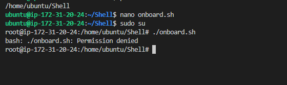

Aux Project

Launch ubuntu instance on aws

Login

Mk dir shell

Move into it and create file called names.csv

Create developers group

Create onboard.sh

Paste script into onboard.sh file. Now run following command

open the file using your favorite editor and paste in the public key

vi id_rsa.pub
create a file for your private key

touch id_rsa
open the file using your favorite editor and paste in the private key.

vi id_rsa

run 

sudo su 

t become root

now run script

Error- no permissions

