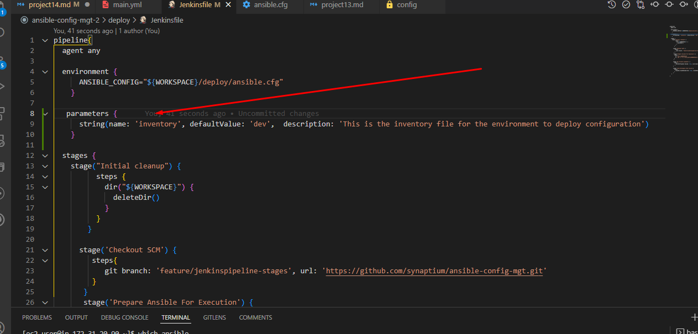
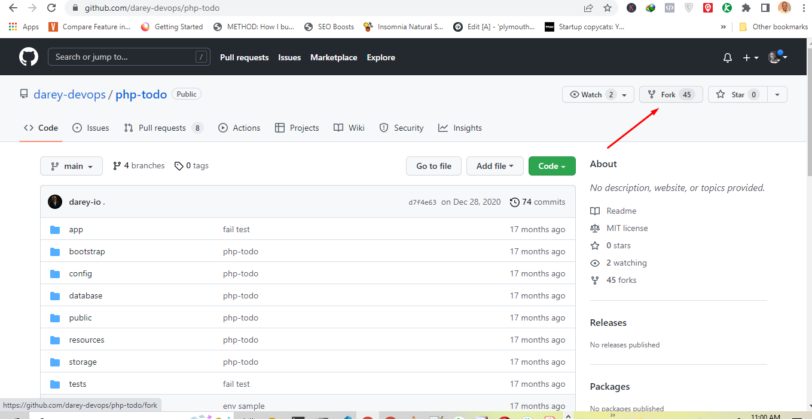
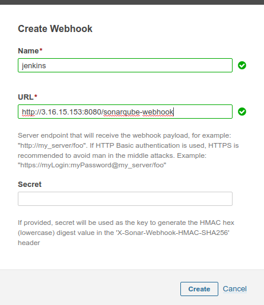

Project 14

Launch a new red hat instance, with t2 medium because you will be sinatlling ansbile and jenkins. Need more space.

Connect via remote host and open the server. To do this, i edited the remote host config file 

Run sudo yum install git -y to install git

Clone Davids repo

Install jenkins

https://www.jenkins.io/doc/book/installing/

Choose OS and wheher ubutu or redhat and see info on how to install

Switch to root with sudo su

and paste

sudo wget -O /etc/yum.repos.d/jenkins.repo \
    https://pkg.jenkins.io/redhat-stable/jenkins.repo

For red hat installation of jenkins

Got this error, because wget is not installed

So found this page on google on how to install wgt on redhat 8

https://www.cyberciti.biz/faq/yum-install-wget-redhat-cetos-rhel-7/

So installed wget and ran my jenkins install again.

Next stage

sudo rpm --import https://pkg.jenkins.io/redhat-stable/jenkins.io.key

yum install -y dnf-utils http://rpms.remirepo.net/enterprise/remi-release-8.rpm

intall java

sudo yum install java-11-openjdk-devel -y

Run the following - we do this to make sure the bash profile is always started when the server is restarted.

##### open the bash profile 
vi .bash_profile 

##### paste the below in the bash profile
export JAVA_HOME=$(dirname $(dirname $(readlink $(readlink $(which javac)))))
export PATH=$PATH:$JAVA_HOME/bin
export CLASSPATH=.:$JAVA_HOME/jre/lib:$JAVA_HOME/lib:$JAVA_HOME/lib/tools.jar

##### reload the bash profile
source ~/.bash_profile

intsall jekins

sudo yum install jenkins

sudo systemctl start jenkins

sudo systemctl enable jenkins

sudo systemctl status jenkins

sudo systemctl daemon-reload

Check jenkins on browser

do a 

sudo cat /var/lib/jenkins/secrets/initialAdminPassword

to get initial passsword and login with it

Install sugegsted plugins

Enter admin details

Now install blue ocean plugin

In vscode got to ansible folder and create a folder called deploy and create a file under it called Jekinsfile

push to git hub and do a git pull on remote server

Now configure the ansible project in jenkins

Under build configuration

change to deploy/Jenkins file

Now go to dashboard, click on project name and click on main

The click on build now

Click on open blue ocean

Now create a new branch called  feature/jenkinspipeline-stages  with git checkout -b feature/jenkinspipeline-stages

Do this in git bach terminal on vscode

On git bash do 

git add .

git commit -m "add jenkins file"

git push

It did a pull merge request on github....

so i merged

Go to jenkins, under ansible project, click scan repository now

Jenkins is seeing the new branch

Now edit the jenkin file

add the following code

   pipeline {
    agent any

   stages {
     stage("Initial cleanup") {
           steps {
             dir("${WORKSPACE}") {
               deleteDir()
            }
           }
         }
     stage('Build') {
       steps {
         script {
           sh 'echo "Building Stage"'
         }
       }
     }

     stage('Test') {
       steps {
         script {
           sh 'echo "Testing Stage"'
         }
       }
     }

     stage('Package'){
       steps {
         script {
	       sh 'echo "Packaging App" '
	     }
       }
     }  

     stage('Deploy'){
       steps {
         script {
	       sh 'echo "Deploying to Dev" '
	     }
       }

    stage("clean up")
      steps {
        cleanWs()
            }
      }
    }  
}

It failed

So the issue was that 

Correct code

   pipeline {
    agent any

   stages {
     stage("Initial cleanup") {
           steps {
             dir("${WORKSPACE}") {
               deleteDir()
            }
           }
         }

     stage('Build') {
       steps {
         script {
           sh 'echo "Building Stage"'
         }
       }
     }

     stage('Test') {
       steps {
         script {
           sh 'echo "Testing Stage"'
         }
       }
     }

     stage('Package'){
       steps {
         script {
	       sh 'echo "Packaging App" '
	     }
       }
     } 

     stage('Deploy'){
       steps {
         script {
	       sh 'echo "Deploying to Dev" '
	     }
       }
     }

     stage("clean up"){
       steps {
        cleanWs()
      }
     }
      
     }
}

It works

Now you need to do a merge request, to update main branch with data from feature/jenkinspipeline-stages branch on Github

To do this if you go to ansible repo on Github and go to main branch, you should see a pull request or go to feature/jenkinspipeline-stages branch and click on contribute and choose open a request, then click pull request, then merge pull request, then confirm merge.

So because of the merge, it triggers main build. It succeeded.

Now install ansible on jenkins

sudo yum install ansible -y

Verify ansible is installed.

There are some ansible dependencies that need to be installed.

Do a sudo su to switch to root

python3 -m pip install --upgrade setuptools
python3 -m pip install --upgrade pip
python3 -m pip install PyMySQL
python3 -m pip install mysql-connector-python
python3 -m pip install psycopg2==2.7.5 --ignore-installed

ansible-galaxy collection install community.postgresql

Do it one by one

Install ansible on Jenkins

Run Ansible playbook

Launch 2 instances

Ngnix- red hat and Db - ubuntu

Remove all the old code in jenkins file and add below

This is the ansible playbook

pipeline{
  agent any
  
  environment {
      ANSIBLE_CONFIG="${WORKSPACE}/deploy/ansible.cfg"
    }

  stages {   
    stage("Initial cleanup") {
          steps {
            dir("${WORKSPACE}") {
              deleteDir()
            }
          }
        }

      stage('Checkout SCM') {
         steps{
            git branch: 'feature/jenkinspipeline-stages', url: 'https://github.com/synaptium/ansible-config-mgt.git'
         }
       }
       stage('Prepare Ansible For Execution') {
        steps {
          sh 'echo ${WORKSPACE}' 
          sh 'sed -i "3 a roles_path=${WORKSPACE}/roles" ${WORKSPACE}/deploy/ansible.cfg'  
        }
       }

      stage('Run Ansible playbook') {
        steps {
           ansiblePlaybook become: true, colorized: true, credentialsId: 'private-key', disableHostKeyChecking: true, installation: 'ansible', inventory: 'inventory/${inventory}', playbook: 'playbooks/site.yml'
         }
      }

      stage('Clean Workspace after build'){
        steps{
          cleanWs(cleanWhenAborted: true, cleanWhenFailure: true, cleanWhenNotBuilt: true, cleanWhenUnstable: true, deleteDirs: true)
        }
      }
   }

}

Jenkins needs to ssh into the instanes so we need to pass the keys to jenkins

Now go to jenkins, click on manage jekins, credentials, global, add credentials 

Choose ssh user with private key.

I got a crumb error.

To fx this go to jenkins manage, install plugin, install crumb issuer plugin.

This worked for me

In the beginning of davids video at about 21:50, he showd other solutions

Now enter thiese settings below for setup of credentials

Now go to dashboard, click on ansible project, click pieline syntax

Its all empty

Now go back to dashboard, manage jenkins, global tool config

scroll down to ansible

Name  - ansible

Path  is

Got to server and do a which ansible

copy the path and paste

/usr/bin/

Go back to pipeline synatax

choose settings below

Click generate

Copy output

and paste in 

Now go to deavids repo and download ansible folder.

replace the following files with his

Roles/Mysql/Default/ Main.yml

Roles/Nginx/tasks/main.yml

Now go to jenkins and scan repo

It gave an error in nginx/task/main.yml

So i compared it to davids repo and see davids was empty so i emptied mine too

Pushed to github again and it worked.

Go to jenkins file on vscode and add following from documentation

parameters {
      string(name: 'inventory', defaultValue: 'dev',  description: 'This is the inventory file for the environment to deploy configuration')
    }

Edit this part too

It did not work.

I deited to dev.yml

Scan repo on jenkins

Now merge the both repos by doing a pull request on the features branch

Thiis so the files will match each other

Now go to jenkins and go to main branch and do a build with parameters

For me it failed , i had to go to my dev.yml on github ib main branch to see that the ips there are wrong

so i deited it on vscode and pushed to github. Now it works.

Next task

Fork the Repo

https://github.com/darey-devops/php-todo.git

Go to server and do a git clone https://github.com/synaptium/php-todo.git

Go to server terminal and install following. Make sure to switch to root

yum module reset php

yum module enable php:remi-7.4

yum install -y php php-common php-mbstring php-opcache php-intl php-xml php-gd php-curl php-mysqlnd php-fpm php-json

systemctl start php-fpm

systemctl enable php-fpm

curl -sS https://getcomposer.org/installer | php

sudo mv composer.phar /usr/bin/composer

Go to jenkins to intall plugins

install plot

install artifactory

No go to davids repo, roles folder and copy artifactory and squarenob folders into my ansible rolders

Go to ci file inventory/ci and edit like this

[jenkins]
<Jenkins-Private-IP-Address>

[nginx]
<Nginx-Private-IP-Address>

[sonar]
<sonar-Private-IP-Address>

[artifactory]
172.31.20.90  ansible_ssh_user='ec2-user'

[db]
172.31.31.25 ansible_ssh_user='ubuntu'

Go to site.yml in playbooks and edit like this

---
# - hosts: db
# - name: database assignment
#   ansible.builtin.import_playbook: ../static-assignments/database.yml

# - hosts: nginx
# - name: nginx assignment
#   ansible.builtin.import_playbook: ../static-assignments/nginx.yml

 - hosts: artifactory
 - name: artifactory assignment
   ansible.builtin.import_playbook: ../static-assignments/artifactory.yml

# - hosts: sonar
# - name: sonar assignment
#  ansible.builtin.import_playbook: ../static-assignments/sonar.yml

# - hosts: todo
# - name: Deploy the todo application
#   ansible.builtin.import_playbook: ../static-assignments/deployment.yml

Now push to github

Now go to features branch and do a pull request to merge with main

Go to gitbash terminal and do git checkout main to swithc then

git checkout pull

go to jekins file and edit this to main

Push to main branch from now on so we can move faster

From 2:10:59 of video - update summaries

Go to main branh on jenkins and click on buiold with parameters, enter ci

open artifactory on port 8081

Login with admin and password

Create a repo in jfrog call PBL

Configure artifactory in Jenkins

Create a new jenkinsfile in todo root folder.

and paste the following from documentation

pipeline {
    agent any

  stages {

     stage("Initial cleanup") {
          steps {
            dir("${WORKSPACE}") {
              deleteDir()
            }
          }
        }

    stage('Checkout SCM') {
      steps {
            git branch: 'main', url: 'https://github.com/darey-devops/php-todo.git'
      }
    }

    stage('Prepare Dependencies') {
      steps {
             sh 'mv .env.sample .env'
             sh 'composer install'
             sh 'php artisan migrate'
             sh 'php artisan db:seed'
             sh 'php artisan key:generate'
      }
    }
  }
}

Go to ansible/roles/mysql/default/main.yml and edit the file

like so

Ip address of mysql homestead user should be ip address of jenkins server.

Push to github, main branch

Go to jenkins and go to main branch and run with parameters

I could not figure out how to push direct to to do repo. so just created the jenkinsfile on github and saved it

Ran playbook for todo and worked

2nd playbook worked

Sonarqbe

Installation And Configuration Of SonarQube
The installation and configuration can be done with SonarQube role which I am currently working on.

After the installation, sonarqube will run on port 9000.

Configure And Jenkins For Quality Gate
In Jenkins, install SonarScanner plugin.

Navigate to configure system in Jenkins and add SonarQube server as shown below.

Generate authentication token in SonarQube. Configure Quality Gate Jenkins Webhook in SonarQube – The URL should point to your Jenkins server "http://{JENKINS_HOST}/sonarqube-webhook/".

Update Jenkins Pipeline to include SonarQube scanning and Quality Gate with:

    stage('SonarQube Quality Gate') {
        environment {
            scannerHome = tool 'SonarQubeScanner'
        }
        steps {
            withSonarQubeEnv('sonarqube') {
                sh "${scannerHome}/bin/sonar-scanner"
            }

        }
    }

After updating and building the Jenkins job it will fail because we have not updated "sonar-scanner.properties"

Configure sonar-scanner.properties – From the step above, Jenkins will install the scanner tool on the Linux server. You will need to go into the tools directory on the server to configure the properties file in which SonarQube will require to function during pipeline execution in "/var/lib/jenkins/tools/hudson.plugins.sonar.SonarRunnerInstallation/SonarQubeScanner/conf/sonar-scanner.properties".

Add the following in the sonar-scanner.properties

sonar.host.url=http://<SonarQube-Server-IP-address>:9000
sonar.projectKey=php-todo
#----- Default source code encoding
sonar.sourceEncoding=UTF-8
sonar.php.exclusions=**/vendor/**
sonar.php.coverage.reportPaths=build/logs/clover.xml
sonar.php.tests.reportPath=build/logs/junit.xml

Conditionally deploy to higher environments
Replace the SonarQube Quality Gate with:
      when { branch pattern: "^develop*|^hotfix*|^release*|^main*", comparator: "REGEXP"}
        environment {
            scannerHome = tool 'SonarQubeScanner'
        }
        steps {
            withSonarQubeEnv('sonarqube') {
                sh "${scannerHome}/bin/sonar-scanner -Dproject.settings=sonar-project.properties"
            }
            timeout(time: 1, unit: 'MINUTES') {
                waitForQualityGate abortPipeline: true
            }
        }
    }
After doing all this, the job isn't running as expected it will just be running nonstop when it gets to the "SonarQube Quality Gate" stage so I was able to solve this by scaling-up the server adding slave nodes to the Jenkins.

Done

