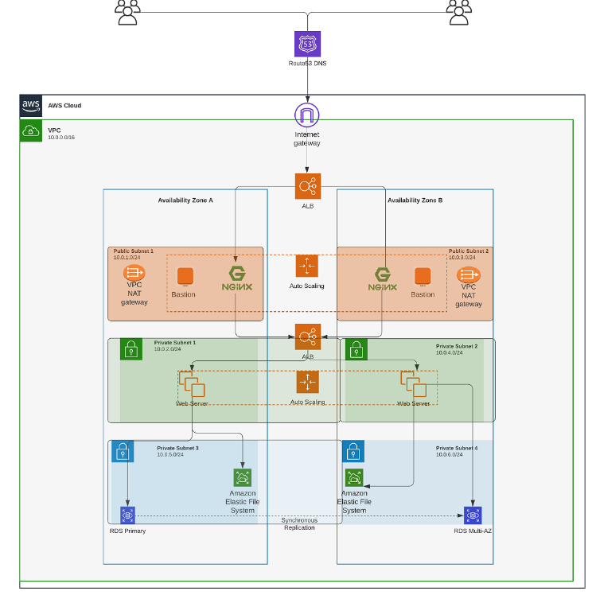

AWS CLOUD SOLUTION FOR 2 COMPANY WEBSITES USING A REVERSE PROXY TECHNOLOGY
WARNING: This infrastructure set up is NOT covered by the AWS free tier. Therefore, ensure to DELETE ALL resources created immediately after finishing this project. Monthly cost may be shockingly high if resources are not deleted. Also, it is strongly recommended to set up a budget and configure notifications when your spendings reach a predefined limit.
Configure your AWS account and Organization Unit
Create an AWS Master account. (Also known as Root Account)
Within the Root account, create a sub-account and name it DevOps. (You will need another email address to complete this)
Within the Root account, create an AWS Organization Unit (OU). Name it Dev. (We will launch Dev resources in there)
Move the DevOps account into the Dev OU.
Login to the newly created AWS account using the new email address.

