AWS CLOUD SOLUTION FOR 2 COMPANY WEBSITES USING A REVERSE PROXY TECHNOLOGY
WARNING: This infrastructure set up is NOT covered by the AWS free tier. Therefore, ensure to DELETE ALL resources created immediately after finishing this project. Monthly cost may be shockingly high if resources are not deleted. Also, it is strongly recommended to set up a budget and configure notifications when your spendings reach a predefined limit.
Configure your AWS account and Organization Unit
Create an AWS Master account. (Also known as Root Account)
Within the Root account, create a sub-account and name it DevOps. (You will need another email address to complete this)
Within the Root account, create an AWS Organization Unit (OU). Name it Dev. (We will launch Dev resources in there)
Move the DevOps account into the Dev OU.
Login to the newly created AWS account using the new email address.

The above diagram is what we want our infrastructure to look like. We are now going to begin setting this up.

Create VPC

Create subnets as shown in the architecture

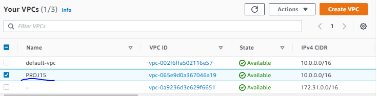

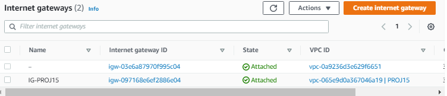

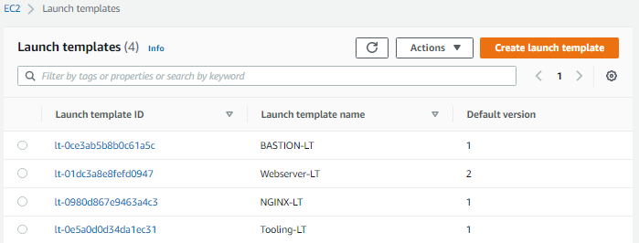

Create an Internet Gateway

Edit a route in public route table, and associate it with the Internet Gateway. (This is what allows a public subnet to be accisble from the internet

Create 3 Elastic IPs

Create a Nat Gateway and assign one of the Elastic IPs (*The other 2 will be used by the Bastion host

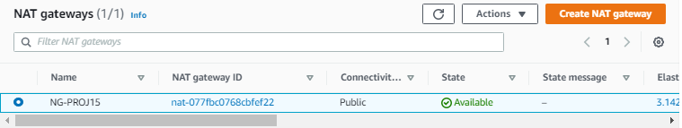

Create a Security Group for:

Nginx Servers: Access to Nginx should only be allowed from a Application Load balancer (ALB). At this point, we have not created a load balancer, therefore we will update the rules later. For now, just create it and put some dummy records as a place holder.
Bastion Servers: Access to the Bastion servers should be allowed only from workstations that need to SSH into the bastion servers. Hence, you can use your workstation public IP address. To get this information, simply go to your terminal and type curl www.canhazip.com
Application Load Balancer: ALB will be available from the Internet
Webservers: Access to Webservers should only be allowed from the Nginx servers. Since we do not have the servers created yet, just put some dummy records as a place holder, we will update it later.
Data Layer: Access to the Data layer, which is comprised of Amazon Relational Database Service (RDS) and Amazon Elastic File System (EFS) must be carefully desinged – only webservers should be able to connect to RDS, while Nginx and Webservers will have access to EFS Mountpoint.
SET UP COMPUTE RESOURCES
NGINX
Create an EC2 Instance based on the RHEL Amazon Machine Image (AMI) in any 2 Availability Zones (AZ) in any AWS Region (it is recommended to use the Region that is closest to your customers). Use EC2 instance of T2 family (e.g. t2.micro or similar)
Ensure that it has the following software installed - python, ntp, net-tools, vim, wget, telnet, epel-release, htop.
yum install -y https://dl.fedoraproject.org/pub/epel/epel-release-latest-8.noarch.rpm 
yum install -y dnf-utils http://rpms.remirepo.net/enterprise/remi-release-8.rpm 
yum install wget vim python3 telnet htop git mysql net-tools chrony -y 
systemctl start chronyd
systemctl enable chronyd
Create an AMI out of the EC2 instance
Make use of the AMI to set up a launch template
Ensure the Instances are launched into a public subnet
Assign appropriate security group
Configure Userdata to update yum package repository and install nginx
Configure Target Groups
Select Instances as the target type
Ensure the protocol HTTPS on secure TLS port 443
Ensure that the health check path is /healthstatus
Register Nginx Instances as targets
Ensure that health check passes for the target group
Configure Autoscaling For Nginx
Select the right launch template
Select the VPC
Select both public subnets
Enable Application Load Balancer for the AutoScalingGroup (ASG)
Select the target group you created before
Ensure that you have health checks for both EC2 and ALB
The desired capacity is 2
Minimum capacity is 2
Maximum capacity is 4
Set scale out if CPU utilization reaches 90%
Ensure there is an SNS topic to send scaling notifications
BASTION
Create an EC2 Instance based on the RHEL Amazon Machine Image (AMI) per each Availability Zone in the same Region and same AZ where you created the Nginx server
Ensure that it has the following software installed - python, ntp, net-tools, vim, wget, telnet, epel-release, htop (You can run the same commands as above).
Associate an Elastic IP with each of the Bastion EC2 Instances
Create an AMI out of the EC2 instance
Make use of the AMI to set up a launch template
Ensure the Instances are launched into a public subnet
Assign appropriate security group
Configure Userdata to update yum package repository and install ansible and git
Configure Target Groups
Select Instances as the target type
Ensure the protocol TCP on port 22
Register Bastion Instances as targets
Ensure that health check passes for the target group
Configure Autoscaling For Bastion
Select the right launch template
Select the VPC
Select both public subnets
Enable Application Load Balancer for the AutoScalingGroup (ASG)
Select the target group you created before
Ensure that you have health checks for both EC2 and ALB
The desired capacity is 2
Minimum capacity is 2
Maximum capacity is 4
Set scale out if CPU utilization reaches 90%
Ensure there is an SNS topic to send scaling notifications
WEBSERVERS
Create 2 separate launch templates for WordPress and Tooling websites

Create an EC2 Instance each for WordPress and Tooling websites per Availability Zone (in the same Region).
Ensure that it has the following software installed - python, ntp, net-tools, vim, wget, telnet, epel-release, htop (You can run the same commands as above).
Create an AMI out of the EC2 instance
Make use of the AMI to set up a launch template
Ensure the Instances are launched into a public subnet
Assign appropriate security group
Configure Userdata to update yum package repository and install wordpress (Only required on the WordPress launch template)

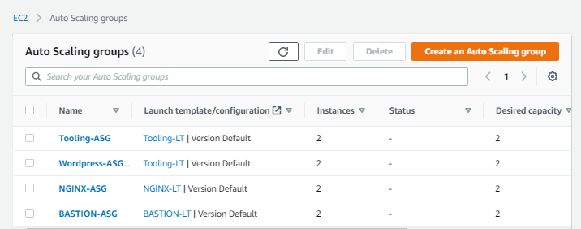

TLS Certificates From Amazon Certificate Manager (ACM)
We will need TLS certificates to handle secured connectivity to our Application Load Balancers (ALB).

Navigate to AWS ACM
Request a public wildcard certificate for the domain name you registered in Freenom
Use DNS to validate the domain name

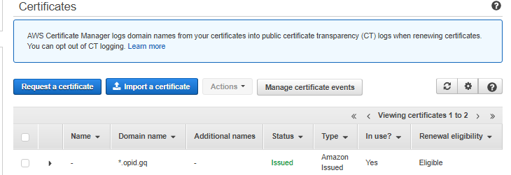

CONFIGURE APPLICATION LOAD BALANCER (ALB)
Application Load Balancer To Route Traffic To NGINX
Nginx EC2 Instances will have configurations that accepts incoming traffic only from Load Balancers. No request should go directly to Nginx servers. With this kind of setup, we will benefit from intelligent routing of requests from the ALB to Nginx servers across the 2 Availability Zones. We will also be able to offload SSL/TLS certificates on the ALB instead of Nginx. Therefore, Nginx will be able to perform faster since it will not require extra compute resources to valifate certificates for every request

Create an Internet facing ALB
Ensure that it listens on HTTPS protocol (TCP port 443)
Ensure the ALB is created within the appropriate VPC | AZ | Subnets
Choose the Certificate from ACM
Select Security Group
Select Nginx Instances as the target group
Application Load Balancer To Route Traffic To Web Servers
Since the webservers are configured for auto-scaling, there is going to be a problem if servers get dynamically scalled out or in. Nginx will not know about the new IP addresses, or the ones that get removed. Hence, Nginx will not know where to direct the traffic.

To solve this problem, we must use a load balancer. But this time, it will be an internal load balancer. Not Internet facing since the webservers are within a private subnet, and we do not want direct access to them.

Create an Internal ALB
Ensure that it listens on HTTPS protocol (TCP port 443)
Ensure the ALB is created within the appropriate VPC | AZ | Subnets
Choose the Certificate from ACM
Select Security Group
Select webserver Instances as the target group
Ensure that health check passes for the target group
NOTE: This process must be repeated for both WordPress and Tooling websites.

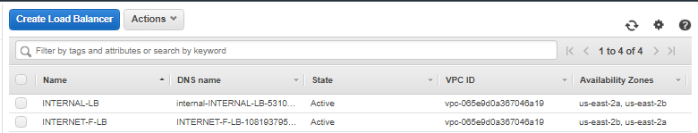

Setup EFS
Create an EFS filesystem
Create an EFS mount target per AZ in the VPC, associate it with both subnets dedicated for data layer
Associate the Security groups created earlier for data layer.
Create an EFS access point. (Give it a name and leave all other settings as default)

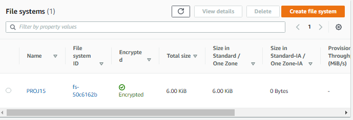

Setup RDS
Pre-requisite: Create a KMS key from Key Management Service (KMS) to be used to encrypt the database instance. To ensure that our databases are highly available and also have failover support in case one availability zone fails, we will configure a multi-AZ set up of RDS MySQL database instance. In our case, since we are only using 2 AZs, we can only failover to one, but the same concept applies to 3 Availability Zones.

Create a subnet group and add 2 private subnets (data Layer)
Create an RDS Instance for mysql 8..
To satisfy our architectural diagram, you will need to select either Dev/Test or Production Sample Template. But to minimize AWS cost, you can select the Do not create a standby instance option under Availability & durability sample template (The production template will enable Multi-AZ deployment)
Configure other settings accordingly (For test purposes, most of the default settings are good to go). In the real world, you will need to size the database appropriately. You will need to get some information about the usage. If it is a highly transactional database that grows at 10GB weekly, you must bear that in mind while configuring the initial storage allocation, storage autoscaling, and maximum storage threshold.
Configure VPC and security (ensure the database is not available from the Internet)
Configure backups and retention
Encrypt the database using the KMS key created earlier
Enable CloudWatch monitoring and export Error and Slow Query logs (for production, also include Audit) Note: This service is an expensinve one. Ensure to review the monthly cost before creating. (DO NOT LEAVE ANY SERVICE RUNNING FOR LONG)

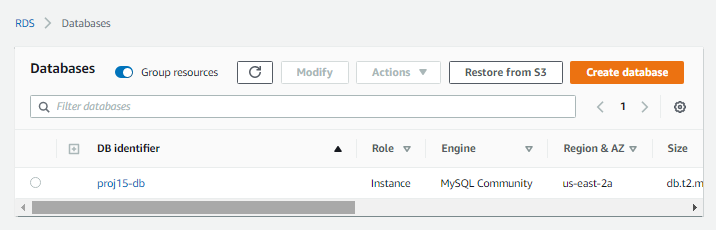

Configuring DNS with Route53
Earlier in this project we registered a free domain with Freenom and configured a hosted zone in Route53. But that is not all that needs to be done as far as DNS configuration is concerned.

We need to ensure that the main domain for the WordPress website can be reached, and the subdomain for Tooling website can also be reached using a browser.

Create other records such as CNAME, alias and A records.

NOTE: You can use either CNAME or alias records to achieve the same thing. But alias record has better functionality because it is a faster to resolve DNS record, and can coexist with other records on that name. Read here to get to know more about the differences.

Create an alias record for the root domain and direct its traffic to the ALB DNS name.
Create an alias record for tooling..com and direct its traffic to the ALB DNS name.

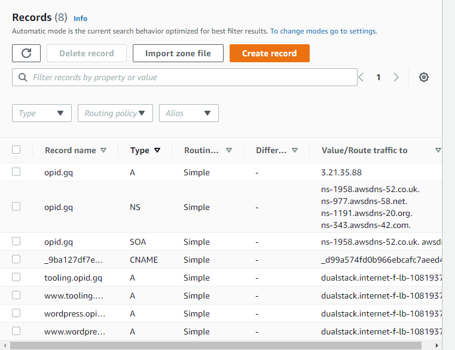

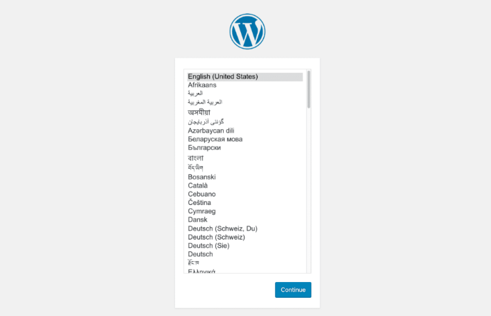

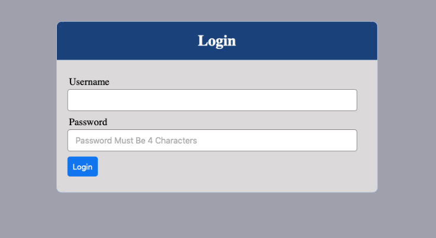