AUTOMATING INFRASTRUCTURE WITH IAC USING TERRAFORM PART 1
INTRODUCTION
This project demonstrates how the AWS infrastructure for 2 websites that was built manually in project 15 is automated with the use of Terraform.

The following outlines the steps taken:

STEP 0: Setting Up AWS CLI And S3 Buckets

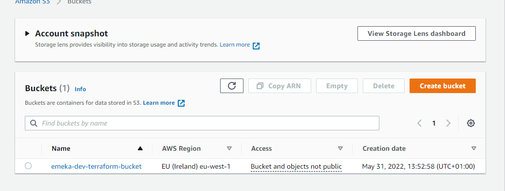

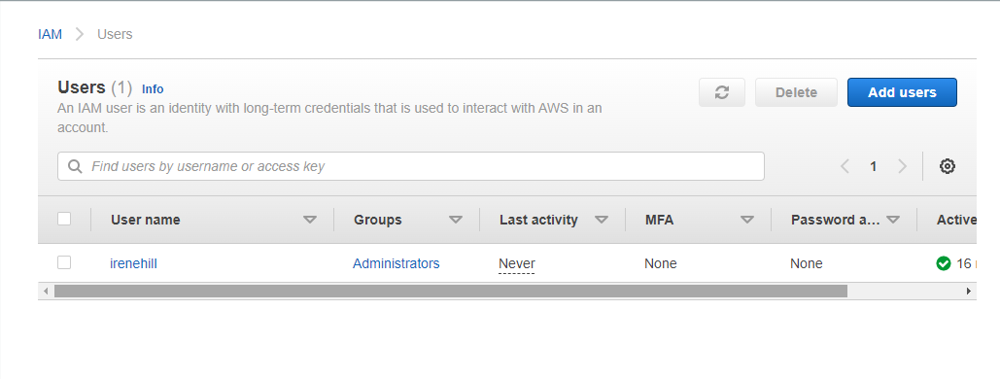

So first i need to configure aws on my pc

First go to https://docs.aws.amazon.com/cli/latest/userguide/getting-started-install.html

download the aws cli msi software and install on my pc

open powershell and run the following commands to add my aws access id and secret key from my iam user to my pc

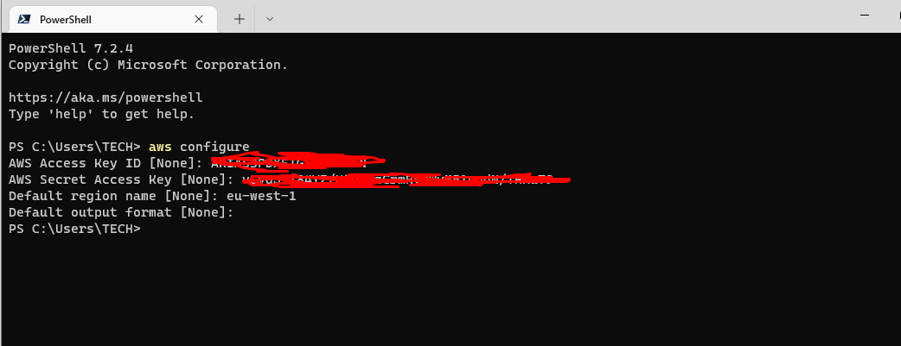

next check the s3 bucket from powershell

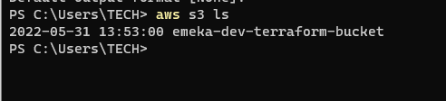

In vscode create a folder called PBL and create a file inside called main.tf

Now install python - https://www.python.org/downloads/

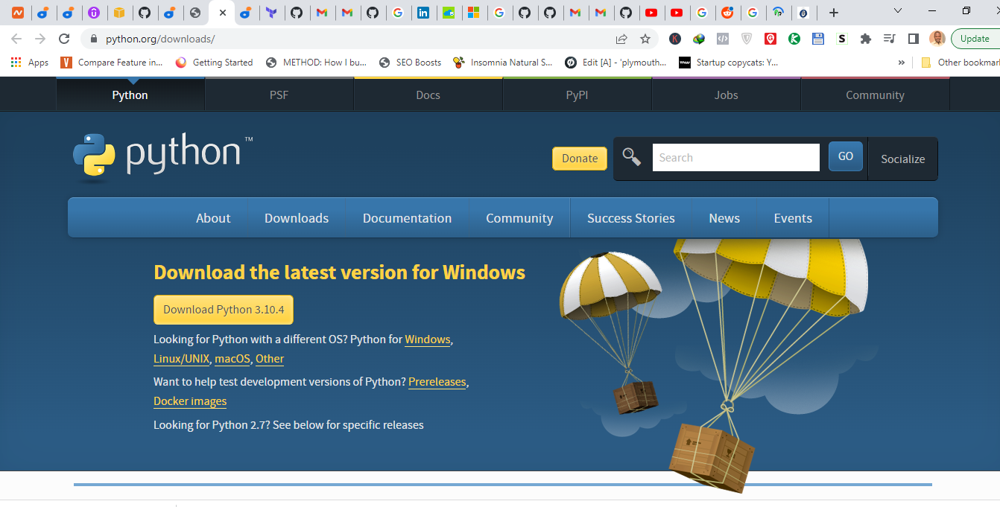

Go to gitbash and isntall pip

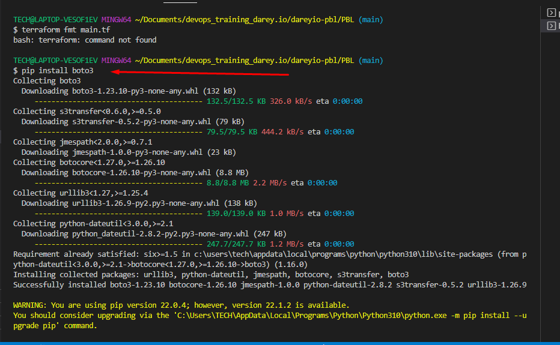

Download terraform for windows 10 and extracted the file to /Downloads/terraform folder

Copy path and got to run on pc.. type env, click enviroment variables, look ofr path and click edit.

Add the new path for terraform you copied.

Run terraform init

Terraform plan  and 

terraform validate

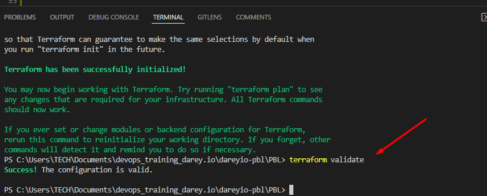

Now followed the documentation and video to edit terraform main.tf to be like below.

    variable "region" {
        default = "eu-west-1"
    }

    variable "vpc_cidr" {
        default = "172.16.0.0/16"
    }

    variable "enable_dns_support" {
        default = "true"
    }

    variable "enable_dns_hostnames" {
        default ="true" 
    }

    variable "enable_classiclink" {
        default = "false"
    }

    variable "enable_classiclink_dns_support" {
        default = "false"
    }

    variable "preferred_number_of_public_subnets" {
   default = 2
    }

provider "aws" {
  region = var.region
}

# Create VPC
resource "aws_vpc" "main" {
  cidr_block                     = var.vpc_cidr
  enable_dns_support             = var.enable_dns_support
  enable_dns_hostnames           = var.enable_dns_hostnames
  enable_classiclink             = var.enable_classiclink
  enable_classiclink_dns_support = var.enable_classiclink
}

# Get list of availability zones
        data "aws_availability_zones" "available" {
        state = "available"
        }

# Create public subnets
resource "aws_subnet" "public" {
  count  = var.preferred_number_of_public_subnets == null ? length(data.aws_availability_zones.available.names) : var.preferred_number_of_public_subnets   
  vpc_id = aws_vpc.main.id
  cidr_block              = cidrsubnet(var.vpc_cidr, 4 , count.index)
  map_public_ip_on_launch = true
  availability_zone       = data.aws_availability_zones.available.names[count.index]

}

Now next stage

Create a new file and name it variables.tf
Copy all the variable declarations into the new file. - get this from main.tf
Create another file, name it terraform.tfvars - get this from documentation
Set values for each of the variables.

run terraform fmt to formart the files

run terraform plan

then terraform apply --auto-approve

Gave erreorrrrrrrrrr

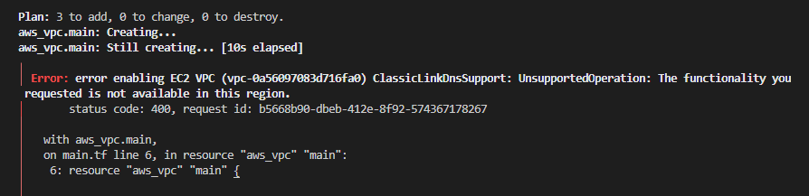

In terraform.tfvars 

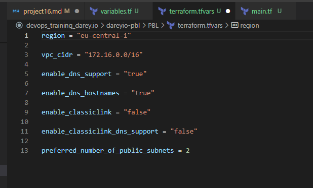

Success!!!

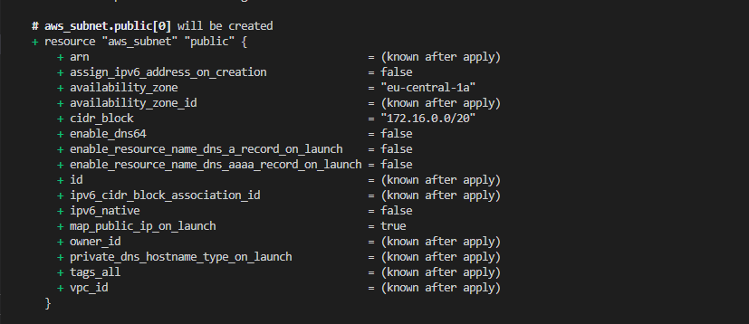

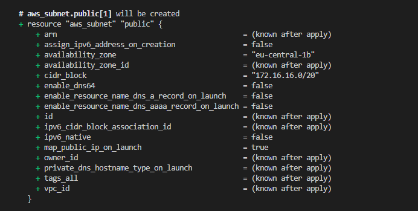

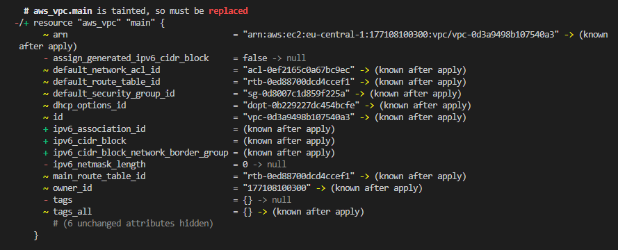

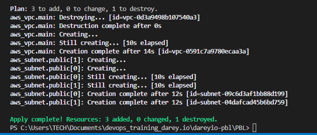

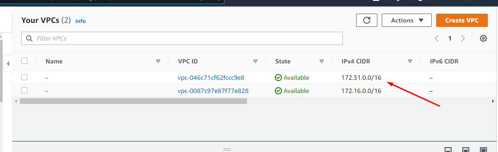

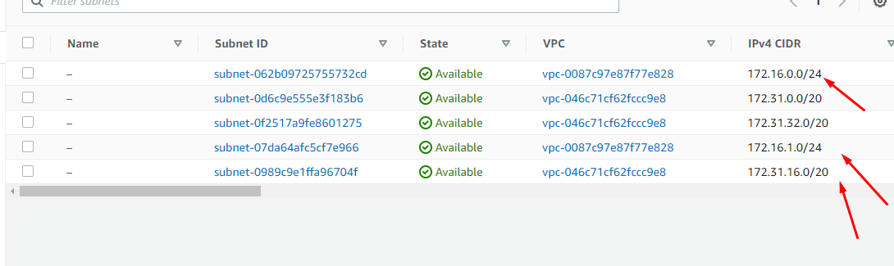

