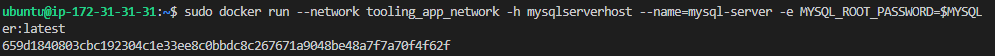

MIGRATION TO THE СLOUD WITH CONTAINERIZATION. PART 1 – DOCKER
In this project we will be installing Docker and prepare for migration to the Cloud. First, we need to install Docker Engine, which is a client-server application that contains:

A server with a long-running daemon process dockerd.
APIs that specify interfaces that programs can use to talk to and instruct the Docker daemon.
A command-line interface (CLI) client docker.


Spin up a t2.medium Ubuntu instance

Now install docker engine

Install using the repository
Before you install Docker Engine for the first time on a new host machine, you need to set up the Docker repository. Afterward, you can install and update Docker from the repository.

Set up the repository
Update the apt package index and install packages to allow apt to use a repository over HTTPS:

```
sudo apt-get update
 sudo apt-get install \
    ca-certificates \
    curl \
    gnupg \
    lsb-release

```

```
Add Docker’s official GPG key:

sudo mkdir -p /etc/apt/keyrings

curl -fsSL https://download.docker.com/linux/ubuntu/gpg | sudo gpg --dearmor -o /etc/apt/keyrings/docker.gpg

```

Use the following command to set up the repository:

echo \
  "deb [arch=$(dpkg --print-architecture) signed-by=/etc/apt/keyrings/docker.gpg] https://download.docker.com/linux/ubuntu \
  $(lsb_release -cs) stable" | sudo tee /etc/apt/sources.list.d/docker.list > /dev/null


Install Docker Engine

Update the apt package index, and install the latest version of Docker Engine, containerd, and Docker Compose, or go to the next step to install a specific version:

sudo apt-get update

sudo apt-get install docker-ce docker-ce-cli containerd.io docker-compose-plugin

Install Docker Engine

sudo apt-get update
sudo apt-get install docker-ce docker-ce-cli containerd.io


Install specific version of Docker


apt-cache madison docker-ce


Step 2: Deploy the MySQL Container to your Docker Engine

Now you have the image you can deploy a new MySQL container:

Replace <container_name> with the name of your choice. If you do not provide a name, Docker will generate a random one

Replace with your chosen password

docker run --name myapp -e MYSQL_ROOT_PASSWORD=cyclone -d mysql/mysql-server:latest
The -d option instructs Docker to run the container as a service in the background

In the command above, we used the latest version tag. This tag may differ according to the image you downloaded

check to see if the MySQL container is running


Pull SQL Image


Deploying a new MySQL container


Change Root password of MYSQL


Create network


Pull the IMAGE and run the container



Check to see if the container is running


Create a file and name it create_user.sql and add the below code in the file:

`````

CREATE USER 'emeka'@'%' IDENTIFIED BY 'cyclone';
GRANT ALL ON * . * TO 'emeka'@'%';
FLUSH PRIVILEGES;
CREATE DATABASE toolingdb;

``````

Run this

docker exec -i mysql-server mysql -uroot -p$MYSQL_PW < create_user.sql 

Ignore the warning

Now Run the MySQL Client Container:


Clone the tooling app and export the location of the SQL file


Use the SQL script to create the database and prepare the schema. With the docker exec command, you can execute a command in a running container.


The .env file is located in the html tooling/html/.env folder but not visible in terminal. you can use vi or nano

So, let us containerize our Tooling application; here is the plan:

Make sure you have checked out your Tooling repo to your machine with Docker engine
First, we need to build the Docker image the tooling app will use. The Tooling repo you cloned above has a Dockerfile for this purpose. Explore it and make sure you understand the code inside it.
Run docker build command
Launch the container with docker run
Try to access your application via port exposed from a container
Let us begin:

Ensure you are inside the directory "tooling" that has the file Dockerfile and build your container :

 $ docker build -t tooling:0.0.1 . 
In the above command, we specify a parameter -t, so that the image can be tagged tooling"0.0.1 - Also, you have to notice the . at the end. This is important as that tells Docker to locate the Dockerfile in the current directory you are running the command. Otherwise, you would need to specify the absolute path to the Dockerfile.

Run the container:
 $ docker run --network tooling_app_network -p 8085:80 -it tooling:0.0.1 


 


