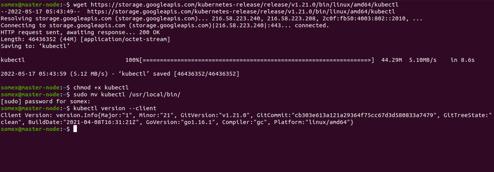

SETTING UP A KUBERNETES CLUSTER FROM GROUND UP (THE HARD WAY)
INTRODUCTION

In this project, a Kubernetes cluster is manually setup from the scratch without any automated helpers in order to better understand each aspect of spinning up a Kubernetes cluster as each components are manually installed from scratch.

The following outlines the steps:

STEP 1: Installing Kubectl On The Local Machine(Linux)

Downloading the binary: $ wget https://storage.googleapis.com/kubernetes-release/release/v1.21.0/bin/linux/amd64/kubectl
Making it executable:$ chmod +x kubectl
Moving the file to the Bin directory:$ sudo mv kubectl /usr/local/bin/
Verifying that kubectl version 1.21.0 or higher is installed:$ kubectl version --client



Step 2: Installing CFSSL And CFSSLJSON

The cfssl is an open source tool by Cloudflare used to setup a Public Key Infrastructure(PKI) for generating, signing and bundling TLS certificates

Downloading the binary:

```
$ wget -q --show-progress --https-only --timestamping \
  https://storage.googleapis.com/kubernetes-the-hard-way/cfssl/1.4.1/linux/cfssl \
  https://storage.googleapis.com/kubernetes-the-hard-way/cfssl/1.4.1/linux/cfssljson

```


Making it executable: $ chmod +x cfssl cfssljson
Moving the file to the bin directory:$ sudo mv cfssl cfssljson /usr/local/bin/