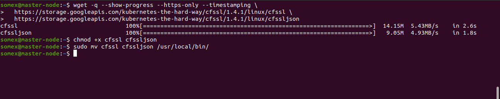

SETTING UP A KUBERNETES CLUSTER FROM GROUND UP (THE HARD WAY)
INTRODUCTION

In this project, a Kubernetes cluster is manually setup from the scratch without any automated helpers in order to better understand each aspect of spinning up a Kubernetes cluster as each components are manually installed from scratch.

The following outlines the steps:

STEP 1: Installing Kubectl On The Local Machine(Linux)

Downloading the binary: $ wget https://storage.googleapis.com/kubernetes-release/release/v1.21.0/bin/linux/amd64/kubectl
Making it executable:$ chmod +x kubectl
Moving the file to the Bin directory:$ sudo mv kubectl /usr/local/bin/
Verifying that kubectl version 1.21.0 or higher is installed:$ kubectl version --client


Step 2: Installing CFSSL And CFSSLJSON

The cfssl is an open source tool by Cloudflare used to setup a Public Key Infrastructure(PKI) for generating, signing and bundling TLS certificates

Downloading the binary:

```
$ wget -q --show-progress --https-only --timestamping \
  https://storage.googleapis.com/kubernetes-the-hard-way/cfssl/1.4.1/linux/cfssl \
  https://storage.googleapis.com/kubernetes-the-hard-way/cfssl/1.4.1/linux/cfssljson

```


Making it executable: $ chmod +x cfssl cfssljson

Moving the file to the bin directory:$ sudo mv cfssl cfssljson /usr/local/bin/




STEP 3: Configuring The Network Infrastructure

Creating a directory named k8s-cluster-from-ground-up and changing directory: $ mkdir 

k8s-cluster-from-ground-up && cd k8s-cluster-from-ground-up

Creating a VPC and storing its ID as a variable:

```

$ VPC_ID=$(aws ec2 create-vpc \
--cidr-block 172.31.0.0/16 \
--output text --query 'Vpc.VpcId'
)

```

Tagging the VPC so that it is named:

```

$ NAME=k8s-cluster-from-ground-up

$ aws ec2 create-tags \
  --resources ${VPC_ID} \
  --tags Key=Name,Value=${NAME}

  ```

  Enabling DNS support for the VPC:

 ```

   $ aws ec2 modify-vpc-attribute \
--vpc-id ${VPC_ID} \
--enable-dns-support '{"Value": true}'

```

Enabling DNS support for hostnames:

```

$ aws ec2 modify-vpc-attribute \
--vpc-id ${VPC_ID} \
--enable-dns-hostnames '{"Value": true}'

```

Setting the required region:$ AWS_REGION=eu-central-1
Configuring DHCP Options Set:

```
$ DHCP_OPTION_SET_ID=$(aws ec2 create-dhcp-options \
  --dhcp-configuration \
    "Key=domain-name,Values=$AWS_REGION.compute.internal" \
    "Key=domain-name-servers,Values=AmazonProvidedDNS" \
  --output text --query 'DhcpOptions.DhcpOptionsId')
```

Tagging the DHCP Option set:

```
$ aws ec2 create-tags \
  --resources ${DHCP_OPTION_SET_ID} \
  --tags Key=Name,Value=${NAME}

```


Associating the DHCP Option set with the VPC:

```
$ aws ec2 associate-dhcp-options \
  --dhcp-options-id ${DHCP_OPTION_SET_ID} \
  --vpc-id ${VPC_ID}

```


Creating the Subnet:

```
$ SUBNET_ID=$(aws ec2 create-subnet \
  --vpc-id ${VPC_ID} \
  --cidr-block 172.31.0.0/24 \
  --output text --query 'Subnet.SubnetId')

```
Tagging the Subnet:

```
$ aws ec2 create-tags \
  --resources ${SUBNET_ID} \
  --tags Key=Name,Value=${NAME}
  ```

Creating the Internet Gateway and tagging it:

```
$ INTERNET_GATEWAY_ID=$(aws ec2 create-internet-gateway \
  --output text --query 'InternetGateway.InternetGatewayId')
$ aws ec2 create-tags \
  --resources ${INTERNET_GATEWAY_ID} \
  --tags Key=Name,Value=${NAME}

```
Attaching the Internet Gateway to the VPC:

```
$ aws ec2 attach-internet-gateway \
  --internet-gateway-id ${INTERNET_GATEWAY_ID} \
  --vpc-id ${VPC_ID}

```
Create route tables, associate the route table to subnet, and create a route to allow external traffic to the Internet through the Internet Gateway:

```
ROUTE_TABLE_ID=$(aws ec2 create-route-table \
  --vpc-id ${VPC_ID} \
  --output text --query 'RouteTable.RouteTableId')
aws ec2 create-tags \
  --resources ${ROUTE_TABLE_ID} \
  --tags Key=Name,Value=${NAME}
aws ec2 associate-route-table \
  --route-table-id ${ROUTE_TABLE_ID} \
  --subnet-id ${SUBNET_ID}
aws ec2 create-route \
  --route-table-id ${ROUTE_TABLE_ID} \
  --destination-cidr-block 0.0.0.0/0 \
  --gateway-id ${INTERNET_GATEWAY_ID}

```


