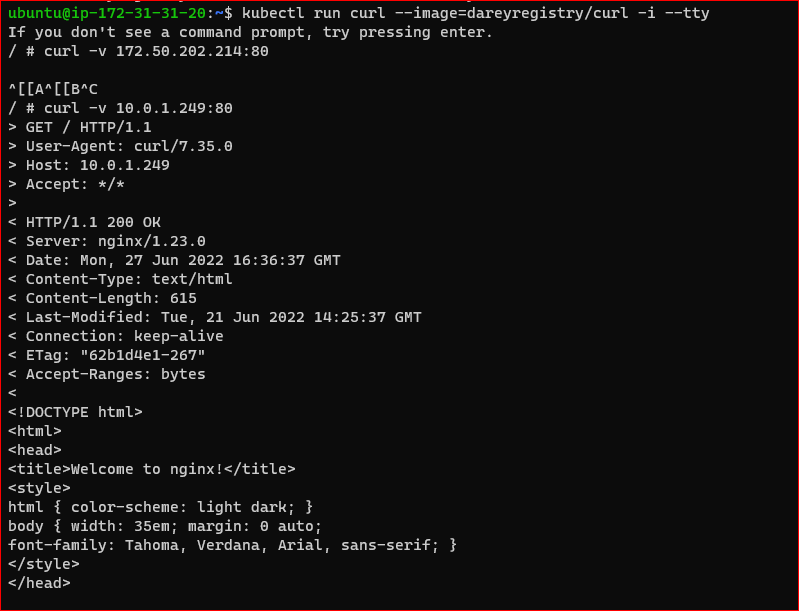
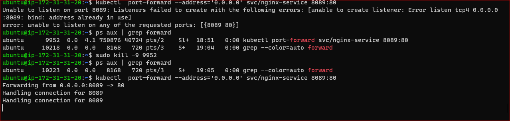
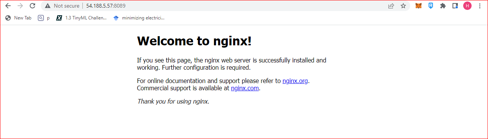
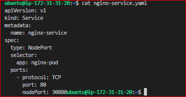
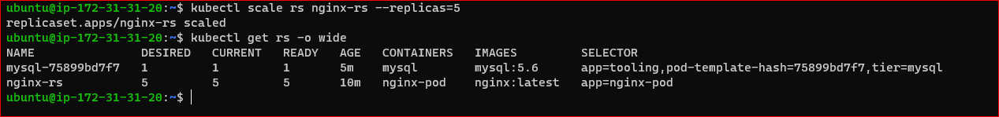
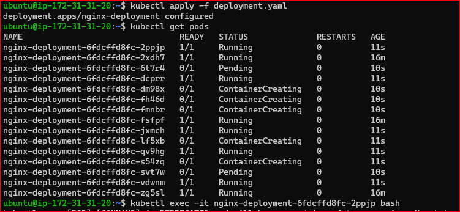
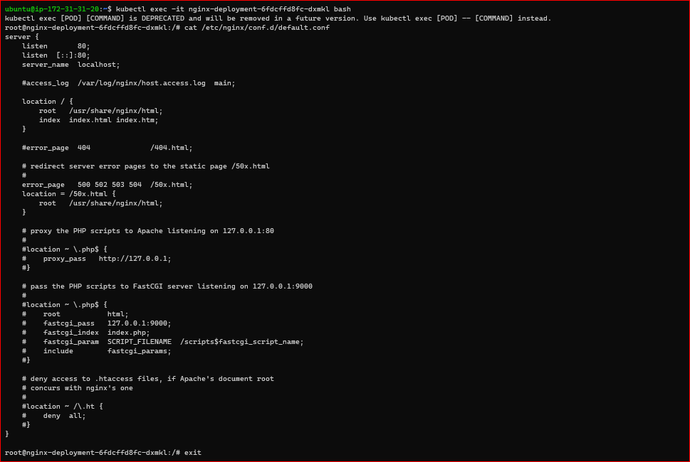
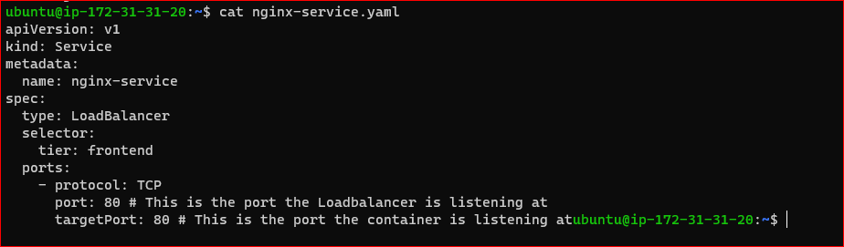

Deploying Applications into Kubernetes Cluster

Common Kubernetes objects

Create an NGINX pod manifest

```
apiVersion: v1
kind: Pod
metadata:
  name: nginx-pod
  labels:
    app: nginx-pod  
spec:
  containers:
  - image: nginx:latest
    name: nginx-pod
    ports:
    - containerPort: 80
      protocol: TCP

```

Apply the manifest

```
kubectl apply -f pod.yaml
```


 Fields:

apiVersion: Which version of the Kubernetes API you're using to create this object

kind: Kind of object to create

metadata: Data that helps uniquely identify the object

spec: Contains further information about the Pod. Where to find the image to run the container – (this defaults to Docker Hub), the port and protocol

Accessing the app from the browser


Access the pod through its IP from within the K8s cluster

```
kubectl run curl --image=dareyregistry/curl -i --tty
```

```
curl -v 172.50.202.214:80
```



Create a service to access to Nginx pod

```
apiVersion: v1
  kind: Service
  metadata:
    name: nginx-service
  spec:
    selector:
      app: nginx-pod 
    ports:
      - protocol: TCP
        port: 80
        targetPort: 80
```

```
kubectl apply -f nginx-service.yaml
```

Update the pod manifest to include the labels metadata


```
apiVersion: v1
  kind: Pod
  metadata:
      name: nginx-pod
      labels:
          app: nginx-pod  
  spec:
      containers:
      - image: nginx:latest
        name: nginx-pod
        ports:
          - containerPort: 80
            protocol: TCP
```

```

 kubectl apply -f nginx-pod.yaml


```

Use port forwarding to attach port 8089 on the node to port 80 on the service

```

kubectl  port-forward svc/nginx-service 8089:80

```

Or

```

kubectl  port-forward --address='0.0.0.0' svc/nginx-service 8089:80


```







Self Side Task

Build the Tooling app Dockerfile and push it to Dockerhub registry

Write a Pod and a Service manifests, ensure that you can access the Tooling app’s frontend using port-forwarding feature.


Expose services using NodePort


```
apiVersion: v1
kind: Service
metadata:
  name: nginx-service
spec:
  type: NodePort
  selector:
    app: nginx-pod
  ports:
    - protocol: TCP
      port: 80
      nodePort: 30080
```



Create a ReplicaSet

Create rs.yaml

```
apiVersion: apps/v1
    kind: ReplicaSet
    metadata:
      name: nginx-rs
    spec:
      replicas: 3
      selector:
          app: nginx-pod
      template:
          metadata:
              name: nginx-pod
              labels:
              app: nginx-pod
          spec:
          containers:
          - image: nginx:latest
              name: nginx-pod
              ports:
              - containerPort: 80
                protocol: TCP  
```

Scale the replicaset

```
kubectl scale rs nginx-rs --replicas=5
```




Using Deployments


Create deployment.yaml file


```
apiVersion: apps/v1
  kind: Deployment
  metadata:
    name: nginx-deployment
    labels:
      tier: frontend
  spec:
    replicas: 3
    selector:
      matchLabels:
      tier: frontend
    template:
      metadata:
        labels:
          tier: frontend
      spec:
        containers:
        - name: nginx
          image: nginx:latest
          ports:
          - containerPort: 80

```

Scale the deployment to 15 pods




List the nginx files in one of the pods

```
kubectl exec -it <pod-name> bash
```


```
ls -ltr /etc/nginx/
```

```
cat  /etc/nginx/conf.d/default.conf 
```




Persisting Data for Pods


Scale down nginx deployment to 1 replica

Exec into the container and install vim

```
 apt-get update
 apt-get install vim

 ```

 Update the content of the file and add the code below /usr/share/nginx/html/index.html


```
<!DOCTYPE html>
  <html>
  <head>
  <title>Welcome to DAREY.IO!</title>
  <style>
      body {
          width: 35em;
          margin: 0 auto;
          font-family: Tahoma, Verdana, Arial, sans-serif;
      }
  </style>
  </head>
  <body>
  <h1>Welcome to DAREY.IO!</h1>
  <p>I love experiencing Kubernetes</p>

  <p>Learning by doing is absolutely the best strategy at 
  <a href="https://darey.io/">www.darey.io</a>.<br/>
  for skills acquisition
  <a href="https://darey.io/">www.darey.io</a>.</p>

  <p><em>Thank you for learning from DAREY.IO</em></p>
  </body>
  </html>

  ```

  Check the browser

  




BLOCKERS:

if you encounter an error while applying an object. check the indentation of the codes in the yaml file
Use the documentation to compare pods and service files to check for missing required parameters.
Open the ports required so that you can access your deployments through a browser.


